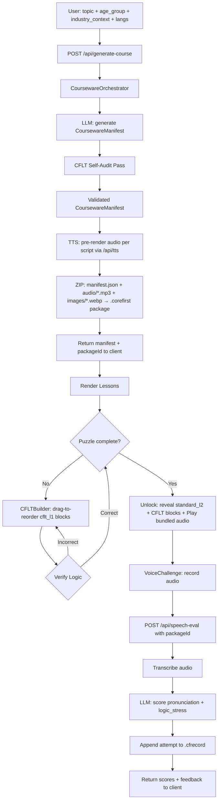

# Course Mode

> Feature spec for the CoreFirst Course Mode.
> Theoretical reference: [cflt.center](https://cflt.center) (CFLT framework manifesto, separate repository).

## Purpose

Course Mode is the structured practice layer of **CoreFirst**. It takes a user-defined topic and generates a complete, CRST-compliant lesson set on demand, then walks the learner through each dialogue line via a two-mode scaffolded flow: a **Learn** mode that demonstrates the CRST decomposition, an optional **Practice** mode that puzzle-tests it, and a **Voice Challenge** that scores delivery. The result is a repeatable, measurable practice session that can be saved, renamed, deleted, exported for sharing, and re-imported into any CoreFirst instance.

## Scope

**Included:**
- **Parameterized Generation:** User supplies a topic, age group, industry context, and source/target language pair; the AI returns a full `CoursewareManifest`.
- **Two-Mode Script Flow (Learn / Practice):** Each dialogue line defaults to **Learn mode** — `CFLTDemo` shows the natural source-language sentence (`standard_l1`) at the top and animates its decomposition into the four CRST blocks below. The learner can switch to **Practice mode** (the original `CFLTBuilder` drag-puzzle) via a per-script toggle. Either path unlocks the same continue-state.
- **Learn Mode (CFLTDemo):** Reveals `standard_l1` (the everyday source-language phrasing) and animates it splitting into core/reason/space/time blocks one by one. No puzzle solving required — the goal is to *see* the CRST pattern, not score it. A "Continue" button advances when all four blocks are revealed (or immediately via the Skip button).
- **Practice Mode (CFLTBuilder):** The original drag-to-reorder interaction over shuffled CRST blocks; validated client-side against the correct `[Core → Reason → Space → Time]` sequence. Optional self-test rather than a gate.
- **Unlock:** On either mode completing, the full `standard_l2` sentence and its CRST block visualization are revealed, with TTS playback available.
- **Voice Challenge (VoiceChallenge):** User records themselves reading the unlocked sentence; the `/api/speech-eval` pipeline transcribes and scores the attempt on Pronunciation and Logic Stress.
- **Package Generation:** On course creation the `CoursewareOrchestrator` generates the manifest, pre-renders TTS audio for every script (CAS-deduplicated by SSML hash — same line in two courses shares one MP3), and writes a Lite manifest at `data/users/<userId>/packages/<slug>.json`. Full `.corefirst` ZIP is optional via `saveFull: true`.
- **Multi-user partitioning:** Every operation takes a `userId` (resolved from `X-User-Id` header → `cf_user_id` cookie → env → `'local'`); packages, records, and media are all scoped under `data/users/<userId>/` so multiple learners sharing a device never see each other's content.
- **Progress Tracking:** Each Voice Challenge attempt is written as its own PouchDB doc in the `events` collection, ID-prefixed by slug for sync-safe enumeration.
- **History, Re-open, Rename, Delete:** The Stats view lists per-user packages. Each row exposes Open / Rename / Delete actions. Rename changes only the displayed `topic` (slug is immutable — it's the join key for every event doc). Delete is a 5-step cascade: manifest unlink → state tombstone → bulk-tombstone every event doc with the slug prefix → orphan vocabulary `firstSeenIn` back-links → sweep orphan media. Returns structured per-step results; HTTP 207 on partial failure.
- **Import / Export:** Users can export any course in the library as a portable `.corefirst` ZIP (Full ZIP manifest + audio + images) and import such files into any user's library. Re-importing the same course (matching `packageId`) is an idempotent overwrite.
- **Vocabulary Capture:** On voice challenge, lesson `vocabulary_focus[]` tokens are captured into the global SRS deck with `(targetLang, token)` composite uniqueness and a `firstSeenIn` back-link to the originating script.

**Excluded:**
- **Lesson-level Progress Gating:** Completing one lesson does not currently unlock the next; all lessons in a manifest are rendered in parallel (Phase 2 item).
- **Script `bestScore` / `attemptCount` Tracking:** Per-script aggregate metrics are deferred to Phase 2.
- **Multi-Device Sync (live):** The PouchDB infrastructure (per-event docs, tombstone-based delete) is ready for sync; the active replication endpoint and cloud registry are not yet shipped.
- **In-place Lesson Edit:** Editing a single lesson script after generation is not supported. To change content, delete + re-generate.

## Core Responsibilities

1. **AI Generation Pipeline** — Accept a `GenerationRequest`, run the `CoursewareOrchestrator`, return a `CoursewareManifest` with all scripts CRST-validated and `standard_l1` backfilled by the audit pass.
2. **Slug Resolution** — Build `<industry>-<targetLang>-<ageGroup>-<topic>` slug; call `resolveUniqueSlug(userId, baseSlug, packageId)` to auto-suffix on collision (different course, same parameters) or reuse on identity match (re-generate same course).
3. **Package Assembly** — Pre-render TTS audio per script via CAS pool (`data/users/<userId>/media/<hash>.mp3`); write Lite manifest at `<slug>.json`; optionally bundle Full ZIP for sharing. Run `pruneOrphanMedia` after write.
4. **Mode State Management** — Track per-script `puzzleMode` (default `'learn'`) and `completedPuzzles` set client-side. Either mode firing `onSuccess` / `onContinue` advances the same gate.
5. **Unlock Presentation** — Render `standard_l2` + CRST block breakdown + bundled audio playback once the gate clears.
6. **Voice Evaluation Forwarding** — Attach `packageId` to every speech-eval request so attempts are written as per-event docs keyed by slug.
7. **History Management** — Surface per-user course list with Open/Rename/Delete actions. Rename updates manifest `topic`; Delete runs the 5-step cascade and returns `{ok, steps, errors}`.

## Interfaces

### Inputs
`POST /api/generate-course` body (`GenerateCourseRequestSchema`):
- `topic` — string, 1–512 characters
- `age_group` — string (e.g., `"Child (Age 8)"`, `"Teenager"`, `"Adult / Professional"`)
- `industry_context` — string (e.g., `"General / Life"`, `"IT / Software Engineering"`, `"Medical / Healthcare"`, `"Business / Finance"`)
- `sourceLang` — optional string, defaults to `"Chinese"`
- `targetLang` — optional string, defaults to `"English"`

### Outputs
`CoursewareManifest & { packageId: string, packageSlug: string }` — top-level fields `age_group`, `industry_context`, `topic`, `packageId`, plus `lessons[]`. Each lesson contains:
- `title`, `scenario_description`
- `cflt_scripts[]` — each script has `speaker`, `cflt_l1`, `cflt_l2`, `standard_l1` (natural source-language form for Learn mode), `standard_l2`, `ssml`
- `visual_generation_prompts[]`
- `imageUrl` — `/api/courses/<slug>/image/<lessonIndex>` (resolved through the per-user CAS pool)
- `vocabulary_focus[]` — array of `{ token, meaning }`

### Edit / Delete API

- `PATCH /api/courses/[slug]` body `{ topic: string }` → renames the displayed topic; slug stays put.
- `DELETE /api/courses/[slug]` → cascade deletes manifest + state + events + vocab back-links + orphan media. Returns `200 {ok:true, steps[]}` on success, `207 {ok:false, steps[], errors[]}` on partial failure.
- All slug-bearing routes (GET/DELETE/PATCH/audio/image) validate `slug` against `/^[a-z0-9-]+$/` at entry — rejects path traversal with 400.

### Component Interfaces

**`CFLTDemo`** (`components/CFLTDemo.tsx`) — Learn mode (default):
- Props: `standardL1`, `cfltL1`, `standardL2`, `uiLang`, `onContinue`
- Shows the natural source-language sentence (`standardL1`, falls back to `standardL2` when empty) at the top, then time-staggers each CRST block (Framer Motion) so the learner watches the decomposition unfold. "Continue" enables once the last block is revealed; "Skip" reveals immediately.

**`CFLTBuilder`** (`components/CFLTBuilder.tsx`) — Practice mode (opt-in):
- Props: `cfltString`, `onSuccess`
- Parses `cfltString` into up to four typed blocks, shuffles them (Fisher-Yates, guaranteed non-identity), renders drag-to-reorder via Framer Motion `Reorder`.
- On "Verify Logic": checks `correctIndex === currentIndex` for all blocks. Correct → `onSuccess` after a 1-second confirmation delay.

**`VoiceChallenge`** (`components/VoiceChallenge.tsx`):
- Props: `expectedText`, `sourceLang`, `targetLang`, `packageId?`, `sessionId?`
- Records via `useRecorder` hook; auto-submits to `/api/speech-eval` on blob ready.
- Displays `pronunciation` and `logic_stress` progress bars plus AI coaching feedback.

**`CourseHistory`** (`components/CourseHistory.tsx`):
- Lists the current user's packages.
- Each row: Open button (loads the course back into the active view) + inline Rename (PATCH the topic) + Delete with `window.confirm`.
- Renders eventId/sessionId/slug provided by `/api/history/courses`.

### Dependencies
- **Courseware Generator** — `CoursewareOrchestrator` in `src/generator/orchestrator.ts` with CFLT self-audit pass.
- **Speech Eval API** — `/api/speech-eval` (transcription via Vercel AI SDK `experimental_transcribe`, scoring via `generateObject`).
- **TTS API** — `/api/tts` → OpenAI `gpt-4o-mini-tts`; called once per script at generation time to pre-render audio into the `.corefirst` package. During playback, audio is read from the package — no TTS API call is made.
- **File Storage** — `.corefirst` package files in `data/packages/`; `.cfrecord` JSON files for learner progress and attempt history.

## Data Flow

## Key Behaviors

### Two-Mode Learning Flow

Each `LessonScript` passes through a single gate (`completedPuzzles[puzzleId]`), but the learner chooses how to reach it:

**Learn mode (default — CFLTDemo):**
1. `standard_l1` shown verbatim at the top (e.g., `"昨天下雨我就没出门。"`)
2. Below, the four CRST blocks fade in one at a time with labels: `[Core: 没出门]`, `[Reason: 因为下雨]`, `[Space: 在家]`, `[Time: 昨天下午]`
3. "Continue" enables when the final block lands. Skipping is allowed.
4. Pedagogical goal: the learner *sees* the same content reorganized into the CRST template, no puzzle-solving overhead.

**Practice mode (opt-in — CFLTBuilder):**
1. The same four blocks but shuffled.
2. Drag-to-reorder; "Verify Logic" checks the sequence.
3. Pedagogical goal: active recall of the CRST ordering.

**Unlock (post-gate):** The card fades in to reveal `standard_l2` in full, the CRST block visualization, and a Play button that reads the pre-rendered audio from the CAS pool.

**Voice Challenge:** `VoiceChallenge` records the learner saying `standard_l2`; the recording is auto-submitted to `/api/speech-eval`. Results: Pronunciation + Logic Stress bars + AI coaching feedback (Phonetic Migration when source is Chinese). The attempt persists as a per-event document keyed by slug.

### Persona-Adaptive Content

The `CoursewareOrchestrator` steers the LLM toward age- and category-appropriate vocabulary:
- `"Child (Age 8)"` + `"Medical / Healthcare"`: simple tokens like "the doctor helps me," short sentences.
- `"Adult / Professional"` + `"IT / Software Engineering"`: category tokens like `deploy`, `endpoint`, `latency`; longer CFLT constructs.

### CFLT Enforcement at Generation

Every generated script passes a self-audit step inside `CoursewareOrchestrator` that re-runs the `CFLTTransformer` on the LLM's first-pass output and overwrites `cflt_l1` / `cflt_l2` if the sequence is non-conformant. Scripts reaching the client are guaranteed to be four-element CFLT-compliant.

### Package Linkage

The `packageId` returned by `/api/generate-course` is stored in the React component state and forwarded with every `VoiceChallenge` call for that course. This links all attempt records in `.cfrecord` to the originating `.corefirst` package, enabling per-course aggregate statistics in the Progress Dashboard.

### CAS Audio Playback

Course audio is pre-rendered at generation time via a per-user CAS pool: `hash = sha256(script.ssml).slice(0, 16)`; audio lives at `data/users/<userId>/media/<hash>.mp3` and the script's `audioFile` field points at it. Two scripts with identical SSML (e.g., the same idiomatic sentence in two different courses) share a single MP3 on disk. During the lesson the audio route resolves the file by hash and streams it back; no runtime TTS call.

When a course is regenerated or deleted, `pruneOrphanMedia(userId)` reclaims hashes no surviving manifest references.

## Persistence Strategy

| Operation | When | Storage | Key Fields |
|---|---|---|---|
| Generate package | Course generation success | `<slug>.json` (Lite manifest) in `data/users/<userId>/packages/`; optional `.corefirst` ZIP for export | `packageId`, `topic`, `ageGroup`, `industry`, `createdAt`, `lessons[].imageFile`, `scripts[].audioFile` (hash refs) |
| Record attempt | Voice Challenge recording submitted | Per-event document in PouchDB `events` collection, ID = `<slug>:attempt:<lesson>:<script>:<isoTime>:<rand>` | `slug`, `lessonIndex`, `scriptIndex`, `data: {transcription, overallScore, pronunciation, logicStress, feedback, …}` |
| Mark puzzle complete | Practice or Learn mode advances | `states/<slug>` doc, `mutate()`-updated | `lessons[].scripts[].puzzleCompleted` |
| Capture vocabulary | Voice challenge for a lesson with `vocabulary_focus[]` | `srs/user` doc, `mutate()`-updated | `vocabulary[]` keyed by `(targetLang, token)`, with `firstSeenIn: {slug, lessonIndex, scriptIndex}` |
| Rename course | User clicks Rename in CourseHistory | Manifest JSON rewrite (slug immutable) | `topic` |
| Delete course | User clicks Delete in CourseHistory | 5-step cascade (manifest unlink → state tombstone → events bulk-tombstone → vocab back-link clear → media GC) | All slug-keyed state/events removed; SRS entries preserved with `firstSeenIn` cleared |

Attempts are written only when a valid `packageId` is present. A failed write is logged (`[speech-eval] Failed to persist attempt`) but does not surface an error to the user — the evaluation result still returns.

### History and Re-open

The Progress Dashboard reads from `GET /api/progress`, which aggregates the current user's `events` collection via `readAllProgress(userId)`. Aggregate statistics (total packages, total attempts, average score, per-package logic/pronunciation averages) are computed server-side. `CourseHistory` lists every course with Open / Rename / Delete actions. Re-opening a course at the last-completed script by reading the `states` doc is a Phase 2 item.

## Phased Feature Rollout

### Phase 1 — Foundation (current)
- Two-mode flow operational (Learn / Practice → Unlock → Voice Challenge).
- Multi-user storage partitioning; CAS media pool with `pruneOrphanMedia` GC.
- Per-event PouchDB documents for transforms/attempts/roleplay (sync-conflict-free).
- Lite-manifest package format; optional Full ZIP for sharing.
- History list + Open/Rename/Delete operations through `CourseHistory`.
- Slug regex validation at every course route boundary.
- `GET /api/progress` aggregates events for the Stats view.
- Vocabulary capture into global SRS deck with `(targetLang, token)` uniqueness + `firstSeenIn` back-link.

### Phase 2 — Progress Tracking
- Per-script `bestScore` / `attemptCount` aggregates (derived from event docs).
- Re-open at last-completed script (read `states/<slug>` doc, scroll to first incomplete).
- Four-CRST-slot sub-scores in speech evaluation (`scoreCoreAction`, `scoreCondition`, `scoreSpaceContext`, `scoreTime`) — schema slots already nullable in attempt event docs.

### Phase 3 — Cross-mode Integration
- After completing a lesson, system prompts: "Practice this scenario in Roleplay."
- Transform Mode detects vocabulary in transformed sentences and shows mastery levels from SRS.
- `firstSeenIn` back-link surfaced in the SRS review UI: "back to the lesson where you met this word."

### Phase 4 — CFLT Profiling and Sync
- Per-user CRST weakness radar chart from sub-scores.
- Adaptive course generation: detect that a user scores low on `[Space/Context]` and suggest courses focused on that element.
- **Live multi-device sync via cloud registry**: PouchDB infrastructure is sync-ready; wiring the actual replication endpoint and registry is the remaining work.

## Constraints

- **Generation Latency:** A complete 5-lesson `CoursewareManifest` must be returned within 30 seconds.
- **CFLT Compliance:** 100% of scripts reaching the client must pass the four-element sequence validator.
- **Audio Size Limit:** `/api/speech-eval` rejects audio blobs exceeding 10 MB; accepted formats are `audio/webm`, `audio/mp4`, `audio/wav`, `audio/mpeg`, `audio/ogg`.
- **Topic Length:** `topic` input is capped at 512 characters.

## Error Handling

- **Orchestrator Failure:** If `CoursewareOrchestrator.generate()` returns an `{ error }` object, the API responds with HTTP 500 and logs `[generate-course] Orchestrator error`. No manifest is written.
- **Speech-Eval Write Failure:** Attempt persistence is fire-and-forget; a `console.error` is emitted but the evaluation response is still returned to the client.
- **Puzzle Reset:** The shuffle button in `CFLTBuilder` re-randomizes block order and clears the `isCorrect` state, allowing the learner to restart the puzzle without reloading the page.
- **Delete Partial Failure:** `deletePackage` is a best-effort cascade — if any step throws, later steps still run. The route returns HTTP 207 with `{ok:false, steps[], errors[]}` so partial cascades are observable end-to-end (logs + response body).
- **Slug Traversal Attempt:** Any route consuming `[slug]` validates against `/^[a-z0-9-]+$/` before storage calls; non-matching slugs return 400.
- **Empty-Vocab Delete:** Deleting a course on a brand-new user (no `captureVocabulary` yet) is safe — `orphanVocabularyForSlug` early-returns when no SRS doc exists rather than corrupting one with a partial put.
