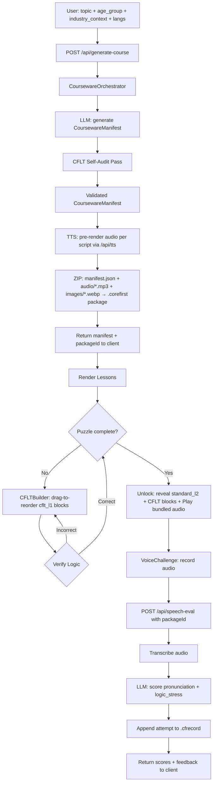

# Course Mode

> Feature spec for the CoreFirst Course Mode.
> Theoretical reference: [cflt.center](https://cflt.center) (CFLT framework manifesto, separate repository).

## Purpose

Course Mode is the structured practice layer of **CoreFirst**. It takes a user-defined topic and generates a complete, CFLT-compliant lesson set on demand, then walks the learner through each dialogue line via a three-step scaffolded flow: a drag-and-arrange **CFLT Puzzle**, an **Unlock** reveal, and a **Voice Challenge**. The result is a repeatable, measurable practice session that can be saved and re-opened from history.

## Scope

**Included:**
- **Parameterized Generation:** User supplies a topic, age group, industry context, and source/target language pair; the AI returns a full `CoursewareManifest`.
- **Three-Step Script Flow:** Each dialogue line progresses through puzzle → unlock → voice challenge before the learner advances.
- **CFLT Puzzle (CFLTBuilder):** Drag-to-reorder interaction over shuffled CFLT blocks; validated client-side against the correct `[Core → Reason → Space → Time]` sequence.
- **Unlock:** On puzzle success, the full `standard_l2` sentence and its CFLT block visualization are revealed, with TTS playback available.
- **Voice Challenge (VoiceChallenge):** User records themselves reading the unlocked sentence; the `/api/speech-eval` pipeline transcribes and scores the attempt on Pronunciation and Logic Stress.
- **Package Generation:** On course creation the `CoursewareOrchestrator` generates the manifest, pre-renders TTS audio for every script (one call per script), and bundles everything into a `.corefirst` package file (ZIP: `manifest.json` + `audio/*.mp3` + `images/*.webp`).
- **Progress Tracking:** Each Voice Challenge attempt is appended to the learner's `.cfrecord` file, keyed by `packageId`.
- **History and Re-open:** The Stats view lists `.corefirst` files found in `data/packages/` and matches them against the `.cfrecord` file to show per-course attempt history; the `packageId` is forwarded with every `VoiceChallenge` so all attempts are associated with the originating package.
- **Vocabulary Display:** Each lesson exposes a `vocabulary_focus[]` panel showing domain-relevant tokens and their meanings.

**Excluded:**
- **Lesson-level Progress Gating:** Completing one lesson does not currently unlock the next; all lessons in a manifest are rendered in parallel (Phase 2 item).
- **Script `bestScore` / `attemptCount` Tracking:** Per-script aggregate metrics are deferred to Phase 2.
- **Vocabulary Mastery Updates from Course:** Pushing lesson vocabulary into the `Vocabulary` table at lesson completion is deferred to Phase 3.
- **Multi-Device Sync:** Syncing `.cfrecord` and `.corefirst` packages across devices is handled by a separate SaaS platform project and is not part of the local app.

## Core Responsibilities

1. **AI Generation Pipeline** — Accepting a `GenerationRequest`, running the `CoursewareOrchestrator`, and returning a `CoursewareManifest` with all lessons fully CFLT-validated.
2. **Package Assembly** — Pre-rendering TTS audio for every script and bundling `manifest.json`, `audio/*.mp3`, and `images/*.webp` into a `.corefirst` ZIP package written to `data/packages/`.
3. **Puzzle State Management** — Tracking per-script puzzle completion client-side (`completedPuzzles` set) to gate the unlock step.
4. **Unlock Presentation** — Rendering the revealed sentence, CFLT block breakdown, and audio playback from the bundled package only after puzzle success.
5. **Voice Evaluation Forwarding** — Attaching `packageId` to every speech-eval request so attempts are appended to the `.cfrecord` file for the active course package.

## Interfaces

### Inputs
`POST /api/generate-course` body (`GenerateCourseRequestSchema`):
- `topic` — string, 1–512 characters
- `age_group` — string (e.g., `"Child (Age 8)"`, `"Teenager"`, `"Adult / Professional"`)
- `industry_context` — string (e.g., `"General / Life"`, `"IT / Software Engineering"`, `"Medical / Healthcare"`, `"Business / Finance"`)
- `sourceLang` — optional string, defaults to `"Chinese"`
- `targetLang` — optional string, defaults to `"English"`

### Outputs
`CoursewareManifest & { packageId: string }` — top-level fields `age_group`, `industry_context`, `topic`, `packageId`, plus `lessons[]`. Each lesson contains:
- `title`, `scenario_description`
- `cflt_scripts[]` — each script has `speaker`, `cflt_l1`, `cflt_l2`, `standard_l2`, `ssml`
- `visual_generation_prompts[]`
- `vocabulary_focus[]` — array of `{ token, meaning }`

### Component Interfaces
**`CFLTBuilder`** (`components/CFLTBuilder.tsx`):
- Props: `cfltString: string`, `onSuccess: () => void`
- Parses `cfltString` on `","` / `"，"` into up to four typed blocks, shuffles them (Fisher-Yates, guaranteed non-identity), and renders a drag-to-reorder list via Framer Motion `Reorder`.
- On "Verify Logic": checks `correctIndex === currentIndex` for all blocks. If correct, fires `onSuccess` after a 1-second confirmation delay.

**`VoiceChallenge`** (`components/VoiceChallenge.tsx`):
- Props: `expectedText`, `sourceLang`, `targetLang`, `packageId?`
- Records via `useRecorder` hook; auto-submits to `/api/speech-eval` on blob ready.
- Displays `pronunciation` and `logic_stress` progress bars plus AI coaching feedback.

### Dependencies
- **Courseware Generator** — `CoursewareOrchestrator` in `src/generator/orchestrator.ts` with CFLT self-audit pass.
- **Speech Eval API** — `/api/speech-eval` (transcription via Vercel AI SDK `experimental_transcribe`, scoring via `generateObject`).
- **TTS API** — `/api/tts` → OpenAI `gpt-4o-mini-tts`; called once per script at generation time to pre-render audio into the `.corefirst` package. During playback, audio is read from the package — no TTS API call is made.
- **File Storage** — `.corefirst` package files in `data/packages/`; `.cfrecord` JSON files for learner progress and attempt history.

## Data Flow

## Key Behaviors

### Three-Step Learning Flow

Each `LessonScript` passes through a locked gate sequence. The gate is managed entirely client-side via the `completedPuzzles` set, keyed by `puzzle-{lessonIndex}-{scriptIndex}`.

**Step 1 — CFLT Puzzle:** The `cflt_l1` string (e.g., `"没出去，因为下雨了，在家，昨天"`) is split and shuffled. The learner drags the blocks into the correct `[Core → Reason → Space → Time]` order and clicks "Verify Logic." A wrong answer shows an error state and keeps the puzzle active. A correct answer shows a green confirmation for 1 second, then fires `onSuccess`.

**Step 2 — Unlock:** After `onSuccess`, the script card transitions (Framer Motion fade-in) to reveal the speaker label, the `standard_l2` sentence in full, the CFLT block visualization for `cflt_l1`, and a Play button that reads the pre-rendered audio from the `.corefirst` package (no TTS API call).

**Step 3 — Voice Challenge:** The `VoiceChallenge` component is rendered below the unlocked content. The learner records themselves saying the sentence; the recording is auto-submitted on stop. Results show two progress bars (Pronunciation, Logic Stress) and an AI coaching note with Phonetic Migration guidance (e.g., Pinyin-referenced corrections when source language is Chinese).

### Persona-Adaptive Content

The `CoursewareOrchestrator` steers the LLM toward age- and domain-appropriate vocabulary:
- `"Child (Age 8)"` + `"Medical / Healthcare"`: simple tokens like "the doctor helps me," short sentences.
- `"Adult / Professional"` + `"IT / Software Engineering"`: domain tokens like `deploy`, `endpoint`, `latency`; longer CFLT constructs.

### CFLT Enforcement at Generation

Every generated script passes a self-audit step inside `CoursewareOrchestrator` that re-runs the `CFLTTransformer` on the LLM's first-pass output and overwrites `cflt_l1` / `cflt_l2` if the sequence is non-conformant. Scripts reaching the client are guaranteed to be four-element CFLT-compliant.

### Package Linkage

The `packageId` returned by `/api/generate-course` is stored in the React component state and forwarded with every `VoiceChallenge` call for that course. This links all attempt records in `.cfrecord` to the originating `.corefirst` package, enabling per-course aggregate statistics in the Progress Dashboard.

### Bundled Audio Playback

Course audio is pre-rendered at generation time — one `/api/tts` call per script — and stored as `audio/{scriptIndex}.mp3` inside the `.corefirst` ZIP. During the lesson, `playAudio(packageId, scriptIndex)` extracts the file from the package, creates a temporary object URL, plays it, then revokes the URL. No TTS API call is made at playback time.

## Persistence Strategy

| Operation | When | Storage | Key Fields |
|---|---|---|---|
| Generate package | Course generation success | `.corefirst` file in `data/packages/` | `packageId`, `topic`, `ageGroup`, `industry`, `createdAt`, bundled audio + images |
| Record attempt | Voice Challenge recording submitted | `.cfrecord` file (attempts section) | `packageId`, `scriptRef`, `expectedText`, `transcription`, `overallScore`, `pronunciation`, `logicStress` |

Attempts are written only when a valid `packageId` is present. A failed file write is caught and logged (`[speech-eval] Failed to persist attempt`) but does not surface an error to the user — the evaluation result is still returned.

### History and Re-open (Phase 1)

The Progress Dashboard reads from `GET /api/progress`, which scans `data/packages/` for `.corefirst` files and reads the matching `.cfrecord` to assemble attempt history. Aggregate statistics (total packages, total attempts, average score, per-package logic/pronunciation averages) are computed server-side. Phase 1 surfaces these as charts; full lesson re-opening at the last-completed script (by reading `completedPuzzles` from `.cfrecord`) is planned for Phase 2.

## Phased Feature Rollout

### Phase 1 — Foundation (current)
- Full three-step flow operational (puzzle → unlock → voice challenge).
- `.corefirst` package generation with pre-rendered audio.
- `.cfrecord` attempt persistence.
- `GET /api/progress` history list and Stats view (reads `.cfrecord`).
- Bundled audio playback (no TTS call at runtime).

### Phase 2 — Progress Tracking
- Per-script `bestScore` and `attemptCount` fields in `.cfrecord` attempt entries.
- Lesson completion state persisted in `.cfrecord`; history view supports re-opening a specific lesson at its last-completed script.
- Four-element CFLT sub-scores in speech evaluation (`coreScore`, `reasonScore`, `spaceScore`, `timeScore`) — requires speech-eval prompt update.

### Phase 3 — Cross-mode Integration
- Lesson `vocabulary_focus[]` tokens pushed to the vocabulary mastery section of `.cfrecord` on lesson unlock.
- After completing a lesson, system prompts: "Practice this scenario in Roleplay."
- Transform Mode detects vocabulary in transformed sentences and shows mastery levels from `.cfrecord`.

### Phase 4 — CFLT Profiling
- Per-user CFLT weakness radar chart derived from four-element sub-scores.
- Adaptive course generation: system detects that a user consistently scores low on `[Space/Context]` and suggests or auto-generates a course focused on that element.

## Constraints

- **Generation Latency:** A complete 5-lesson `CoursewareManifest` must be returned within 30 seconds.
- **CFLT Compliance:** 100% of scripts reaching the client must pass the four-element sequence validator.
- **Audio Size Limit:** `/api/speech-eval` rejects audio blobs exceeding 10 MB; accepted formats are `audio/webm`, `audio/mp4`, `audio/wav`, `audio/mpeg`, `audio/ogg`.
- **Topic Length:** `topic` input is capped at 512 characters.

## Error Handling

- **Orchestrator Failure:** If `CoursewareOrchestrator.generate()` returns an `{ error }` object, the API responds with HTTP 500 and logs `[generate-course] Orchestrator error`. No `.corefirst` package file is written.
- **Speech-Eval Write Failure:** Attempt persistence to `.cfrecord` is fire-and-forget; a `console.error` is emitted but the evaluation response is still returned to the client.
- **Puzzle Reset:** The shuffle button in `CFLTBuilder` re-randomizes block order and clears the `isCorrect` state, allowing the learner to restart the puzzle without reloading the page.
