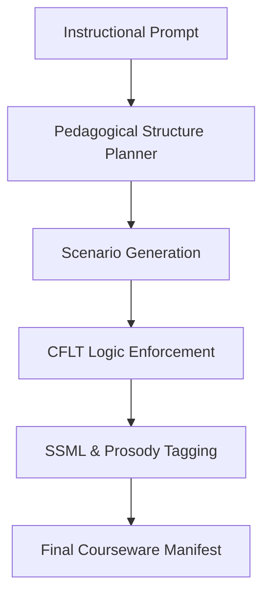

# CFLT Courseware Generator

> Feature spec for the CoreFirst Courseware Generator.
> Theoretical reference: [cflt.center](https://cflt.center) (CFLT framework manifesto, separate repository).

## Purpose

The CFLT Courseware Generator is an AI-driven engine that creates structured educational content (tutorials) under **Core-First Language Theory (CFLT)**. As a sub-module of the **CoreFirst** application, it enables the rapid creation of scenario-based lessons for different age groups and industries, emphasizing audio-visual integration. All generated content adheres to the CFLT four-element sequence.

## Scope

**Included:**
- **Scenario Synthesis:** Generating multi-turn dialogues or descriptive texts following the Core-First sequence.
- **Persona Adaptation:** Adjusting vocabulary complexity and tone for specific age groups and professional contexts via the `age_group` and `domain_context` inputs.
- **Domain Vocabulary Bias:** Steering the LLM toward domain-specific terminology via `domain_context` (e.g., IT English: *deploy, refactor, debug, latency, endpoint, scalability*). A structured JSON token-pack mechanism is not yet implemented.
- **Audio-Visual Metadata:** Per-script `ssml` emphasizing Core blocks for TTS, plus `visual_generation_prompts` for image generation.
- **Young Learner Safeguards:** Age-specific guidance injection and a permissive audit path for "Young Child (Under 12)" content.

**Excluded:**
- **Final Asset Rendering:** Actual generation of audio/video files (handled by specialized media service integrations).
- **User Progress Tracking:** Handled by a separate Analytics/LMS module.

## Core Responsibilities

1. **Lesson Plan Orchestration** — Creating a pedagogical sequence from a single prompt (e.g., "5 lessons on Business Networking").
2. **Structural Consistency Audit** — Ensuring every sentence in the tutorial adheres to the CFLT four-element protocol `[Core] → [Reason] → [Space] → [Time]`.
3. **Multimodal Instruction Design** — Providing metadata that links specific CFLT blocks to visual or audio emphasis.

## Interfaces

### Inputs
`GenerationRequest` (see `src/generator/orchestrator.ts`):
- `age_group`, `domain_context`, `topic`
- `sourceLang` (default `Chinese`), `targetLang` (default `English`)

### Outputs
**Courseware Manifest** (JSON, validated by `CoursewareManifestSchema` in `src/types/courseware.ts`) — top-level fields `age_group`, `domain_context`, `topic`, plus `lessons[]`. Each lesson contains:
- `title`
- `scenario_description`
- `cflt_scripts[]` — each script has `speaker`, `cflt_l1`, `cflt_l2`, `standard_l2`, and `ssml` (per-script SSML emphasizing Core blocks)
- `visual_generation_prompts[]`
- `vocabulary_focus[]` — array of `{ token, meaning }`

### Dependencies
- **Logic Transformer Engine** — Each generated script is re-audited through `CFLTTransformer` in a self-audit pass; the audited `cflt_l1` / `cflt_l2` overwrite the LLM's first-pass values.
- **Content LLM** — the `courseGen` feature resolves provider + model via `COURSE_GEN_PROVIDER` / `COURSE_GEN_MODEL` > `TEXT_PROVIDER` / `TEXT_MODEL` > baked-in default (`google` + `gemini-3.1-pro-preview`). See `src/lib/ai/`.
- **TTS** — the `tts` feature pre-renders one MP3 per script at package creation time, consuming the per-script `ssml`. Default: `openai` + `gpt-4o-mini-tts`. Swap via `TTS_PROVIDER` / `TTS_MODEL`, or extend `src/lib/ai/text-to-speech/sdk/`.
- **Image** — the `imageGen` feature pre-renders one WebP per lesson from the first `visual_generation_prompts` entry. Default: `google` + `imagen-4.0-generate-001`. Swap via `IMAGE_GEN_PROVIDER` / `IMAGE_GEN_MODEL`.

## Data Flow

## Key Behaviors

### Dynamic Complexity Scaling
For a "Hospital" scenario:
- **Child Mode:** Uses tokens like "Big chair" for MRI, focus on simple actions ("The doctor helps me").
- **Medical Pro Mode:** Uses tokens like "Resonance Imaging," focus on diagnostic logic ("The MRI confirmed the lesion").

### Logical Emphasis (Audio)
The generator provides SSML (Speech Synthesis Markup Language) metadata instructing the TTS engine to adjust pitch, rate, and volume for the `[Core Action]` block. This ensures that the audio delivery reinforces the cognitive structure of CFLT by placing natural emphasis on core results.

### Real-Time Progress Streaming (SSE)
`POST /api/generate-course` returns a `text/event-stream` response instead of a buffered JSON body. The client reads the stream via `src/lib/sse-reader.ts` and updates the UI step label in real time:

| Event | When emitted |
|-------|-------------|
| `{ type: 'step', message: 'Designing lessons…' }` | LLM call starts |
| `{ type: 'step', message: 'Auditing scripts…' }` | Parallel CFLT audit starts |
| `{ type: 'step', message: 'Generating audio… (N/M)' }` | After each script's TTS file |
| `{ type: 'step', message: 'Generating images… (N/M)' }` | After each lesson's image |
| `{ type: 'step', message: 'Packaging…' }` | Before `writePackage()` |
| `{ type: 'complete', result: { …manifest, packageId, packageSlug } }` | Final, closes stream |
| `{ type: 'error', message: '…' }` | On any exception |

`CoursewareOrchestrator` and `buildAndWritePackage` accept an optional `onProgress: ProgressEmitter` callback. Existing callers (CLI, tests) pass no callback and are unaffected.

### Domain ComboBox
The domain field in the UI is a `ComboBox` component (searchable, keyboard-navigable, ARIA-compliant) with 18 built-in presets:

`General / Life` · `Stories / Fairy Tales` · `Animals / Nature` · `Arts & Crafts` · `Music / Songs` · `School / Academic` · `Hobbies / Interests` · `Sports / Recreation` · `Social / Daily Life` · `IT / Software Engineering` · `Medical / Healthcare` · `Business / Finance` · `Legal / Law` · `Education / Teaching` · `Design / Creative` · `Sales / Marketing` · `Travel / Hospitality` · `Logistics / Operations`

Users may also type any custom domain value; presets are suggestions only.

### Young Learner Safeguards

The orchestrator injects age-group and domain guidance into the courseware prompt via `loadSkill()`:

| Age Group | Tone & Vocabulary |
|-----------|-------------------|
| `Young Child (Under 12)` | Picture-book words only, ≤6-word CFLT elements, warm/playful tone |
| `Young Learner (Age 12+)` | Everyday + school vocabulary, friendly/curious tone |
| `Teenager` | Casual contemporary, relatable tone |
| `Adult / Professional` | Full vocabulary, neutral/formal tone |

For "Young Child" content, the CFLT self-audit pass uses `auditScript` (permissive) instead of the strict `CFLTTransformer` — young learners' naturally short sentences often omit optional CFLT slots, and strict enforcement would rewrite them incorrectly.

## Constraints

- **Consistency:** 100% of generated tutorial text must pass the CFLT validator (four-element Core-First sequence required).
- **Scalability:** Capable of generating a 5-lesson module in under 30 seconds. Typical observed time: 20–30 seconds (LLM + TTS per-script + optional image per-lesson). SSE streaming makes the wait perceptible and informative rather than opaque.

## Error Handling

- **Topic Out of Bounds:** If a requested topic is inappropriate or impossible to map to CFLT, the generator suggests a related but viable alternative.
- **Missing / Invalid API Key:** Returns `HTTP 401`; the client detects this on the SSE preflight check (`response.status === 401`) before reading the stream and shows the "Open Settings →" key-error banner.
