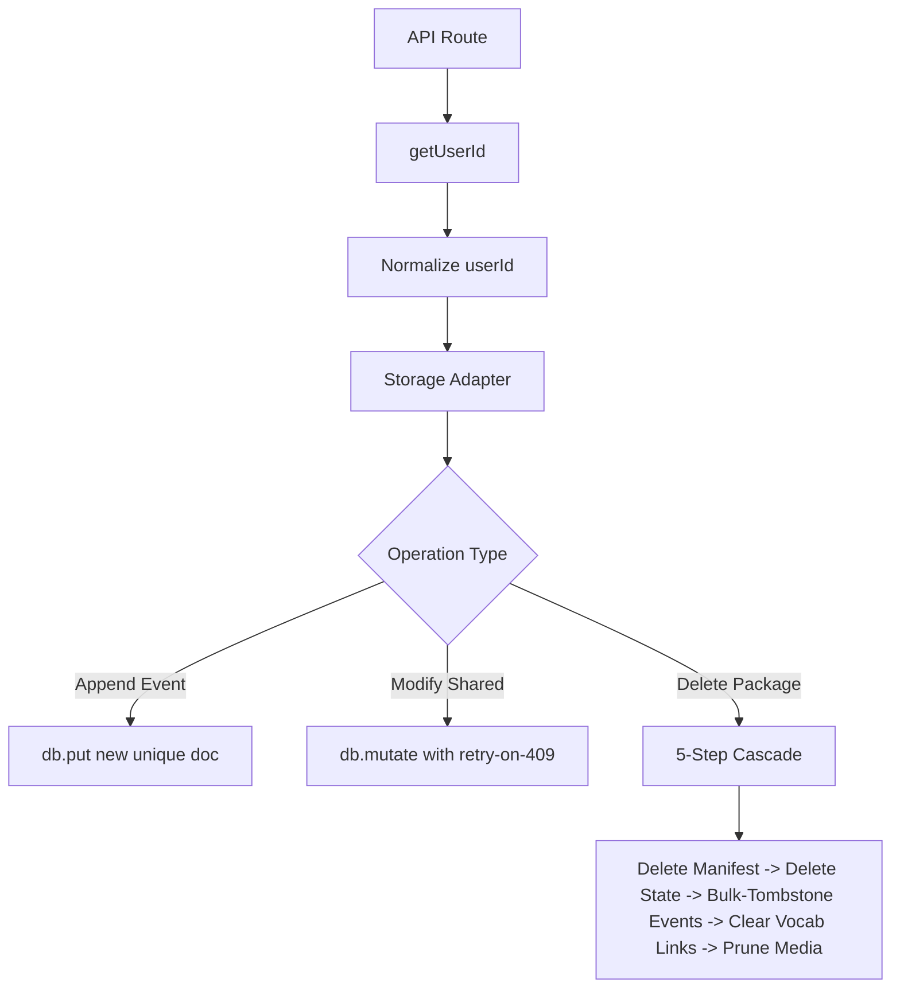

# History & Storage

> Feature spec for code-forge implementation planning.
> Source: extracted from docs/prd.md and docs/tech-design.md
> Created: 2026-05-11

## Purpose

The History & Storage module manages the persistence, isolation, and lifecycle of all learner data. It ensures that every action (transform, voice attempt, roleplay turn) is recorded in a way that is safe for multi-device sync, partitioned for multi-user environments, and easily manageable (rename/delete) by the learner.

## Scope

**Included:**
- **Multi-User Partitioning:** Isolation of data under `data/users/<userId>/`.
- **Per-Event Persistence:** Storing actions as individual PouchDB documents to avoid sync conflicts.
- **Hierarchical History Management:** Listing, renaming, and deleting records across Transforms, Roleplay Sessions, and Course Packages.
- **Cascade Deletion:** Atomic-like cleanup of all associated data (events, states, media) when a parent package is deleted.
- **Conflict-Safe Writes:** Using PouchDB revisions and a `mutate` primitive to handle concurrent writes.

**Excluded:**
- **Live Sync Replication:** The PouchDB infrastructure is sync-ready, but the actual replication to a cloud registry is out of scope for this module.
- **Raw Audio Storage:** Audio blobs are CAS-deduplicated in the filesystem (`media/`), not stored inside the database.

## Core Responsibilities

1. **Identity Resolution** — Extract and normalize `userId` from headers, cookies, or environment variables.
2. **Namespace Partitioning** — Ensure every filesystem and database call is restricted to the current user's directory.
3. **Event-Sourced Storage** — Write attempts and messages as discrete docs with unique IDs (`<slug>:<type>:<timestamp>:<rand>`) instead of growing arrays.
4. **History Orchestration** — Provide API endpoints for listing and modifying history entries (Transforms, Roleplay Sessions, Course Manifests).
5. **Garbage Collection** — Sweep orphan media files (CAS) that are no longer referenced by any manifest after a deletion.

## Interfaces

### Inputs
- **`X-User-Id` Header / `cf_user_id` Cookie** — Used to resolve identity.
- **Event Data** — JSON payloads for transforms, voice attempts, and roleplay messages.
- **Modification Requests** — DELETE/PATCH calls to history API routes.

### Outputs
- **User Filesystem** — `data/users/<userId>/{packages, media, records}/`.
- **History Collections** — Filtered results for `GET /api/history/*`.

### Dependencies
- **PouchDB (LevelDB)** — Underlying database engine for structured records.
- **Filesystem (Node.js `fs`)** — For binary media and JSON manifests.

## Data Flow

## Key Behaviors

### Sync-Safe Append
By writing each event (e.g., a voice attempt) as a separate document with a stable, unique ID, we eliminate the need to read-modify-write a shared array. This prevents `_conflict` errors when two devices sync concurrently.

### 5-Step Cascade Delete
When a user deletes a course, the system performs a thorough cleanup:
1. **Unlink Manifest**: Remove the `.json` file.
2. **Tombstone State**: Mark the progress doc as deleted in PouchDB.
3. **Prefix Scan & Tombstone**: Use `listByPrefix` to find all events starting with the course slug and bulk-delete them.
4. **Vocab Decoupling**: Remove `firstSeenIn` references from the SRS deck.
5. **Media GC**: Run `pruneOrphanMedia` to reclaim disk space from unused hashes.

### Path Whitelisting
The `userId` is normalized to `[a-z0-9_-]`. Any attempt to use `..` or `/` in a `userId` or `slug` is rejected at the API boundary, preventing path traversal attacks.

## Constraints

- **Atomicity:** While PouchDB doesn't support multi-doc transactions, the cascade delete is designed to be idempotent and observable (returns a step-by-step result log).
- **Concurrency:** `db.mutate` must handle PouchDB `409 Conflict` by re-running the mutator function against the updated document.

## Error Handling

- **Partial Cascade:** If a cascade delete fails mid-way, the API returns HTTP 207 (Multi-Status) with a detailed list of which steps succeeded and which failed.
- **Invalid Identity:** Requests without a resolvable `userId` default to the `'local'` namespace.
