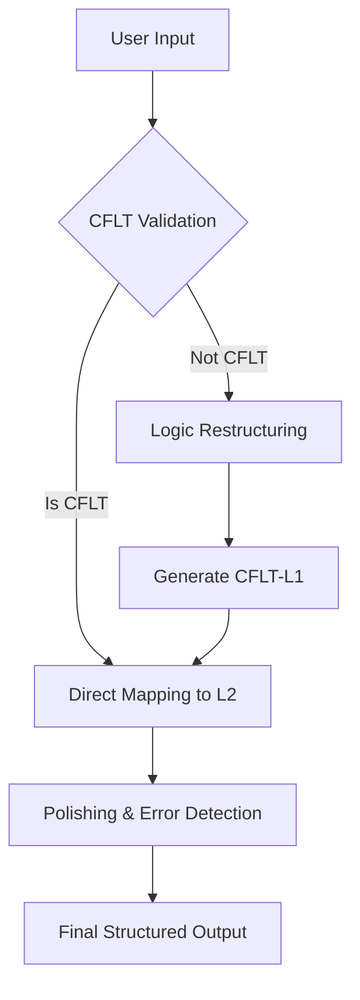

# Logic Transformer Engine

> Feature spec for the CoreFirst Logic Transformer.
> Theoretical reference: [cflt.center](https://cflt.center) (CFLT framework manifesto, separate repository).

## Purpose

The Logic Transformer Engine is the core cognitive processing unit of the **CoreFirst** application and the canonical runtime implementation of **CFLT — Core-First Language Theory**. It transforms natural language input into the standardized Core-First sequence, bridges it to a target language, and provides a polished, idiomatic output with transparent error correction.

## Scope

**Included:**
- **CFLT Structuring:** Reorganizing L1 input into `[Core Action/Result] → [Condition/Reason] → [Space/Context] → [Time]`. All four elements are mandatory.
- **Bilingual Mapping:** Generating CFLT-target (token-swapped) and Standard-target output.
- **Validation:** Detecting if the user's input already follows the CFLT protocol.
- **Grammar Overlay:** Identifying and highlighting corrections — typed as `logic`, `grammar`, or `vocabulary` — in a non-intrusive way.
- **Configurable Display:** Handling the visibility of different output layers (CFLT-L2, Standard-L2, Standard-L1).
- **Multi-language:** The system prompt is parameterized by `{{SOURCE_LANG}}` / `{{TARGET_LANG}}`. Chinese↔English is the validated pair (see `tests/core/test_vectors.md`); other pairs are supported by the prompt template but require their own test vectors before being declared production-ready.

**Excluded:**
- **Local Dictionary Management:** No hard-coded local atomic vocabulary (fully LLM-driven).
- **Speech-to-Text (STT) / Text-to-Speech (TTS):** Handled by separate modules (`/api/speech-eval`, `/api/tts`).

## Core Responsibilities

1. **Protocol Enforcement** — Analyzes input and enforces the four-element Core-First sequence.
2. **Contextual Translation** — Uses LLM to map semantic intent to target language tokens.
3. **Refinement & Correction** — Polishes CFLT output into idiomatic English while tracking specific grammatical shifts.
4. **Display State Management** — Provides structured data for the UI to toggle different levels of linguistic representation.

## Interfaces

### Inputs
- **User Prompt** (String) — Natural or CFLT-structured input from the user.
- **Configuration** (Object) — Display preferences (e.g., `showNativeStandard: true`).

### Outputs
- **CFLT Object** (JSON, validated by `CFLTResponseSchema` in `src/types/cflt.ts`):
  - `is_cflt_compliant` (Boolean)
  - `cflt_l1` (Reconstructed native logic in Core-First sequence)
  - `cflt_l2` (Token-swapped target logic)
  - `standard_l2` (Idiomatic target output)
  - `standard_l1` (Polished native reference)
  - `corrections` — array of `{ type: 'logic' | 'grammar' | 'vocabulary', original, replacement, reason }`

### Dependencies
- **Text Provider** — the `transform` feature resolves provider + model via env precedence `TRANSFORM_PROVIDER` / `TRANSFORM_MODEL` > `TEXT_PROVIDER` / `TEXT_MODEL` > baked-in default (`google` + `gemini-3.1-pro-preview`). Subscription CLIs (`cli/claude`, `cli/gemini`) are also valid text providers. See `src/lib/ai/`.

## Data Flow

## Key Behaviors

### Logic-First Transformation
If the input is `昨天下雨我在家没出去`, the engine MUST prioritize outputting the core result first: `I didn't go out, because it rained, at home, yesterday.`

### Transparent Grammar Overlay
Instead of just giving the correct sentence, the engine identifies *why* a change was made (e.g., "Changed 'go' to 'went' because of the [Time: Yesterday] token").

### Native Reference Generation
Provides a "back-translated" standard version of the input to ensure the user knows the AI understood their exact intention.

## Constraints

- **Latency:** Logic transformation should complete within 2 seconds for a standard sentence.
- **Accuracy:** Logic restructuring must adhere strictly to the four-element Core-First sequence: `[Core] → [Reason] → [Space] → [Time]`. Outputs missing `[Space]` are non-conformant.

## Error Handling

- **Ambiguous Input:** If the input is too vague to parse logic, the engine should return a request for clarification using CFLT principles.
- **LLM Timeout:** Fallback to a simpler translation if the complex CFLT prompt fails.

## Notes
- Fully LLM-dependent for the MVP to prioritize speed of iteration over local lexical control.
- Output layers should be modular to support "toggle-view" in the UI.
