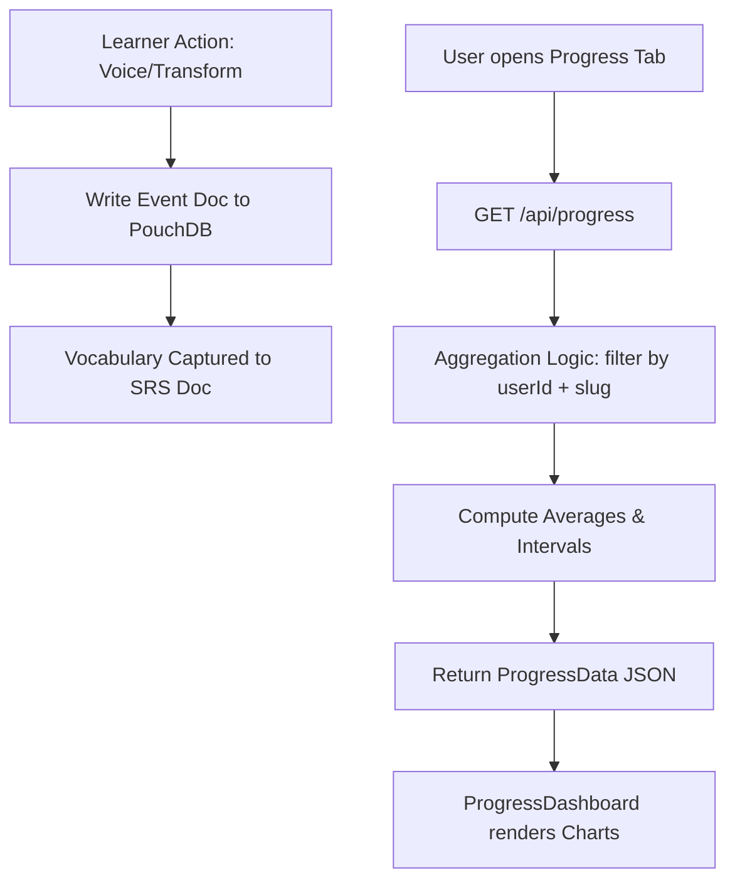

# Progress Analytics

> Feature spec for code-forge implementation planning.
> Source: extracted from docs/prd.md and docs/tech-design.md
> Created: 2026-05-11

## Purpose

Progress Analytics provides a visual dashboard of the learner's journey. it aggregates data from ad-hoc transforms, structured course attempts, and roleplay sessions to build a comprehensive map of CFLT protocol mastery. It also manages the Spaced Repetition System (SRS) for vocabulary captured during practice.

## Scope

**Included:**
- **Aggregate Statistics:** Total courses started/completed, total voice attempts, and average scores.
- **Trend Analysis:** Score history for Pronunciation and Logic Stress over time (Recharts-powered).
- **SRS Vocabulary Management:** Tracking mastery levels, intervals, and next-review dates for tokens captured from lessons.
- **Logic Stress Heatmap:** Visualizing mastery across the four CFLT elements (Core, Reason, Space, Time).
- **Multi-user Aggregation:** All stats are scoped to the active `userId`.

**Excluded:**
- **Live Leaderboards:** No competitive social features in Phase 1.
- **Detailed Log Export:** Raw event logs are available via History tabs, not the Analytics dashboard.

## Core Responsibilities

1. **Data Aggregation** — Scan the `events` and `srs` PouchDB collections for the current user to compute session and mastery totals.
2. **Mastery Scoring** — Calculate the "CFLT Compliance Score" by weighting Logic Stress vs. Pronunciation across historical attempts.
3. **SRS Scheduling** — Implement the SM-2 algorithm (or equivalent) to determine vocabulary review intervals based on production success in Voice Challenges.
4. **Visual Rendering** — Map processed data to Recharts components (Line Chart for trends, Heatmap/Radar for element mastery).

## Interfaces

### Inputs
- **`GET /api/progress`** (Server-side) — Aggregates records from `db_events` and `db_srs` for the active `userId`.
- **Learner Events** (PouchDB) — `AttemptEvent`, `TransformEvent`, `RoleplayMessageEvent`.
- **SRS Deck** (PouchDB) — `CFSRSSchema` containing the vocabulary array.

### Outputs
- **`ProgressData` Object** (Client-side) — Consumed by `ProgressDashboard.tsx`. Contains:
  - `overallStats`: `{ totalAttempts, avgPronunciation, avgLogicStress }`
  - `trends`: `Array<{ date, score, type }>`
  - `vocabulary`: `{ totalMastered, pendingReview, heatmapData }`

### Dependencies
- **PouchDB Provider** (`src/lib/storage/pouch-provider.ts`) — For raw record retrieval.
- **Recharts** — For dashboard visualization.

## Data Flow

## Key Behaviors

### Logic Stress Tracking
Unlike traditional apps that track vocabulary, Progress Analytics tracks "Logic Ordering" as a first-class metric. It highlights if a user consistently scores low on specific elements (e.g., forgetting the `[Space/Context]` block).

### SRS Capture
Vocabulary is not added manually. When a learner passes a Voice Challenge for a script containing `vocabulary_focus` tokens, those tokens are automatically upserted into the SRS deck with a `firstSeenIn` back-link.

### Partitioned Calculation
Aggregations are calculated per-user. The default `local` user sees their own stats; SaaS users (via `X-User-Id`) see their private learning map.

## Constraints

- **Latency:** Dashboard load time should be < 1s for up to 1,000 events.
- **Accuracy:** Mastery level 100% must correlate to consistent logic-stress scores above 90.

## Error Handling

- **Empty State:** If no events exist, the dashboard shows a "Start your first lesson" call-to-action instead of empty charts.
- **Database Timeout:** Failures in PouchDB scans return a 500 with a "Stats temporarily unavailable" message.
