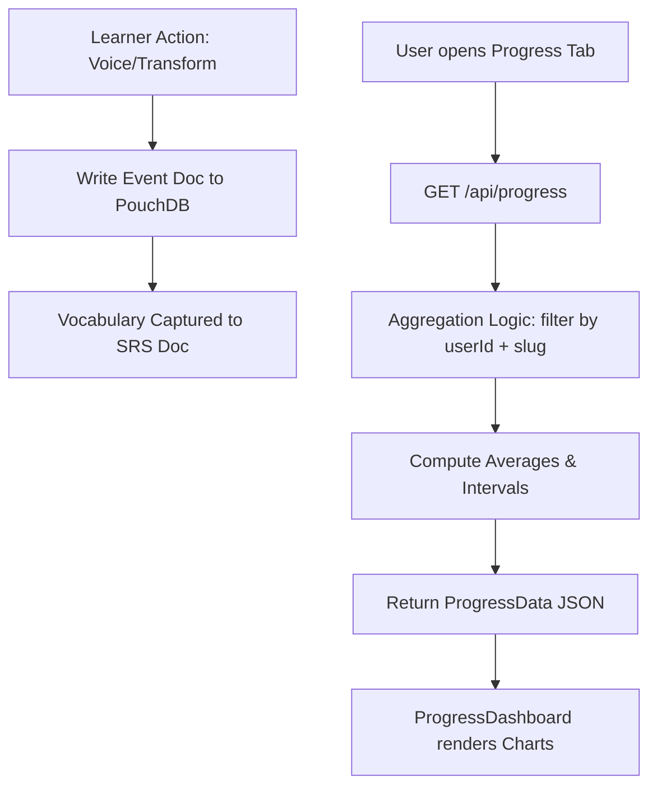

# Progress Analytics

> Feature spec for code-forge implementation planning.
> Source: extracted from docs/prd.md and docs/tech-design.md
> Created: 2026-05-11

## Purpose

Progress Analytics provides a visual dashboard of the learner's journey. it aggregates data from ad-hoc transforms, structured course attempts, and roleplay sessions to build a comprehensive map of CFLT protocol mastery. It also manages the Spaced Repetition System (SRS) for vocabulary captured during practice.

## Scope

**Included:**
- **Aggregate Statistics:** Total courses started/completed, total voice attempts, and average scores.
- **Trend Analysis:** Score history for Pronunciation and Logic Stress over time (Recharts-powered).
- **SRS Vocabulary Management:** Tracking mastery levels, intervals, and next-review dates for tokens captured from lessons.
- **Logic Stress Heatmap:** Visualizing mastery across the four CFLT elements (Core, Reason, Space, Time).
- **Multi-user Aggregation:** All stats are scoped to the active `userId`.

**Excluded:**
- **Live Leaderboards:** No competitive social features in Phase 1.
- **Detailed Log Export:** Raw event logs are available via History tabs, not the Analytics dashboard.

## Core Responsibilities

1. **Data Aggregation** — Scan the `events` and `srs` PouchDB collections for the current user to compute session and mastery totals.
2. **Mastery Scoring** — Calculate the "CFLT Compliance Score" by weighting Logic Stress vs. Pronunciation across historical attempts.
3. **SRS Scheduling** — Implement the SM-2 algorithm (or equivalent) to determine vocabulary review intervals based on production success in Voice Challenges.
4. **Visual Rendering** — Map processed data to Recharts components (Line Chart for trends, Heatmap/Radar for element mastery).

## Interfaces

### Inputs
- **`GET /api/progress`** (Server-side) — Aggregates records from `db_events` and `db_srs` for the active `userId`.
- **Learner Events** (PouchDB) — `AttemptEvent`, `TransformEvent`, `RoleplayMessageEvent`.
- **SRS Deck** (PouchDB) — `CFSRSSchema` containing the vocabulary array.

### Outputs
- **`ProgressData` Object** (Client-side) — Consumed by `ProgressDashboard.tsx`. Contains:
  - `overallStats`: `{ totalAttempts, avgPronunciation, avgLogicStress }`
  - `trends`: `Array<{ date, score, type }>`
  - `vocabulary`: `{ totalMastered, pendingReview, heatmapData }`

### Dependencies
- **PouchDB Provider** (`src/lib/storage/pouch-provider.ts`) — For raw record retrieval.
- **Recharts** — For dashboard visualization.

## Data Flow

## Key Behaviors

### Logic Stress Tracking
Unlike traditional apps that track vocabulary, Progress Analytics tracks "Logic Ordering" as a first-class metric. It highlights if a user consistently scores low on specific elements (e.g., forgetting the `[Space/Context]` block).

### SRS Capture
Vocabulary is not added manually. When a learner passes a Voice Challenge for a script containing `vocabulary_focus` tokens, those tokens are automatically upserted into the SRS deck with a `firstSeenIn` back-link.

### Partitioned Calculation
Aggregations are calculated per-user. Each UUID identity (assigned by `middleware.ts`) sees only their own stats; the system is multi-user-safe.

### Vocabulary Review (SRS Flashcard Drill)
When the Memory section shows `due > 0`, a **"Review X due →"** button and a clickable due-count card open the `VocabReview` modal. The modal fetches due words from `GET /api/vocabulary/due?lang=<targetLang>`, shuffles them, and presents one flashcard at a time:

1. **Front:** meaning (L1 definition)
2. **Flip (tap or button):** target-language token revealed
3. **Answer:** "Knew it!" (`POST /api/vocabulary/review { knew: true }`) or "Didn't know" (`knew: false`)
4. **SM-2 update:** `updateVocabularyMastery()` adjusts interval/easeFactor/reviewCount per result
5. **Done screen:** session summary + "Review again" option

### Learning Curve Threshold
The learning curve line chart (Logic / Pronunciation / Overall over time) is hidden when fewer than 3 data points exist, showing a contextual message instead: *"Complete N more voice challenges to see your progress curve."* This prevents a misleading one-point or two-point chart.

### Cross-Tab Vocabulary Analytics
A **"Vocabulary in Practice"** section (teal, below Memory) shows which SRS words the learner has used organically in Roleplay sessions. Data sourced from `GET /api/progress/vocab-usage` (cached 60 s).

- Summary bar: *"12 of 45 vocabulary words used in Roleplay — 27%"*
- Left column: used words with session-count badges (`deploy 4×`)
- Right column: "Try using these" — words never used in conversation
- Expandable full list toggle

The endpoint scans all `roleplay-msg` events for the user, counts distinct sessions per token using word-boundary matching (CJK tokens: substring match; Latin tokens: non-alpha boundary required).

### Empty State — Actionable CTAs
When no data exists at all, the dashboard shows two action buttons instead of just a message:
- **"Try Transform"** — switches to the Transform tab
- **"Generate a Course"** — switches to the Course tab

## Constraints

- **Latency:** Dashboard load time < 1 s for up to 1,000 events.
- **Accuracy:** Mastery 100% correlates to consistent logic-stress scores above 90.
- **Vocab-usage scan:** O(events × tokens). Acceptable at typical scale (<200 messages, <100 tokens). Result cached `Cache-Control: private, max-age=60`.

## Error Handling

- **Empty State:** No events → "Start your first lesson" CTA with direct tab navigation buttons.
- **Database Timeout:** Failures in PouchDB scans return 500; dashboard shows "Stats temporarily unavailable".
- **Vocab-usage failure:** `CrossTabSection` silently hides itself (non-critical analytics section); error logged to console.
