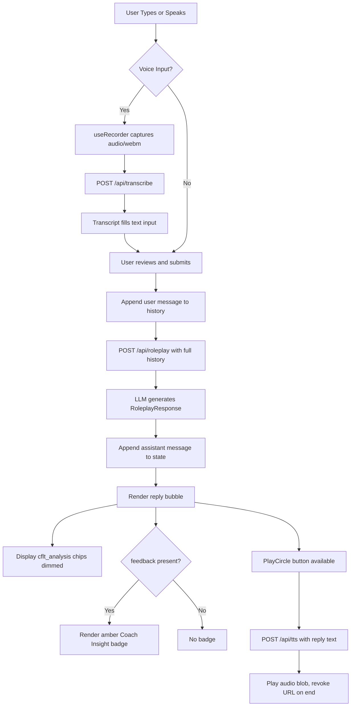

# Roleplay Coach

> Feature spec for the CoreFirst Roleplay Coach.
> Theoretical reference: [cflt.center](https://cflt.center) (CFLT framework manifesto, separate repository).

## Purpose

The Roleplay Coach is an AI-driven conversational module that serves as the **output stage** of the CoreFirst learning journey. After learners discover Core-First Language Theory through the **Logic Transformer** (ad-hoc sentence analysis) and reinforce it through **Course** (structured, scaffolded practice), the Roleplay Coach provides a free, multi-turn dialogue environment where they apply acquired CFLT structure in natural, open-ended conversation. The coach monitors the user's logic sequencing in real time, delivers targeted coaching feedback when deviations occur, and annotates its own replies with CFLT block analysis — keeping the four-element sequence `[Core Action/Result] → [Condition/Reason] → [Space/Context] → [Time]` visible at every turn.

## Scope

**Included:**
- **Multi-Turn Dialogue:** Maintaining the full message history in memory and passing it as context to the LLM on every turn.
- **CFLT Enforcement:** Detecting deviations in the user's logic sequence and generating targeted, natural-language coaching feedback.
- **CFLT Self-Annotation:** Each AI reply includes a `cflt_analysis` field that exposes the coach's own CFLT block structure, reinforcing the method by example.
- **TTS Playback:** Playing AI messages aloud via `/api/tts`, with a per-message `ssml` field providing prosody hints that emphasize Core blocks.
- **Voice Input:** Recording user speech via `useRecorder`, transcribing it through `/api/transcribe`, and pre-filling the text input for user review before sending.
- **Context Injection:** An optional free-text `context` field (e.g., "Job interview at a tech company") that steers the scenario without changing the coaching rules.

**Excluded:**
- **VoiceChallenge on AI Replies:** Pronunciation evaluation of AI-generated text is not implemented in the current phase.
- **Session Persistence and History** *(Phase 1)*: Saving `RoleplaySession` entries to `.cfrecord`, the session list view, and re-opening past conversations are deferred.
- **Cross-Mode Vocabulary Update** *(Phase 3)*: Propagating vocabulary from AI responses to the vocabulary mastery section of `.cfrecord` is deferred.
- **Automatic Course Suggestions** *(Phase 3)*: Post-conversation weak-pattern detection triggering targeted Course recommendations is deferred.

## Core Responsibilities

1. **Conversation Management** — Accumulate `Message[]` in component state; serialize the full history to JSON and pass it as the LLM prompt on every turn, preserving conversational continuity.
2. **CFLT Enforcement** — The system prompt instructs the LLM to detect when the user's response does not follow the Core-First sequence and to populate the `feedback` field with a targeted correction. When the user's logic is correct, `feedback` is `null`.
3. **CFLT Self-Annotation** — Each AI response includes `cflt_analysis` (the coach's own reply decomposed into CFLT blocks) and `ssml` (an SSML-tagged version of the reply with prosody emphasis on the Core block), surfaced in the message bubble.
4. **Voice Input Pipeline** — `useRecorder` captures audio via the browser MediaRecorder API (`audio/webm`); on `stop`, the blob is POSTed to `/api/transcribe`; the returned transcript is written into the text input field for user review before sending.
5. **TTS Output** — When the user taps the PlayCircle button, the raw reply text is POSTed to `/api/tts`; the returned audio blob is played via a transient `Audio` object with automatic URL revocation on completion.

## Interfaces

### Inputs
`RoleplayRequestSchema` (validated in `app/api/roleplay/route.ts`):
- `messages` — array of `{ role: 'user' | 'assistant', content: string }` representing the full conversation history
- `sourceLang` — learner's native language (must be a member of `ALLOWED_LANGUAGES`)
- `targetLang` — practice language (must be a member of `ALLOWED_LANGUAGES`)
- `context` *(optional)* — free-text scenario description; sanitized of control characters and capped at `MAX_CONTEXT_LEN` (500 chars) before prompt injection

### Outputs
`RoleplayResponseSchema` (Zod schema, `app/api/roleplay/route.ts`):
- `reply` (string) — the coach's standard conversational response in the target language
- `ssml` (string) — SSML-tagged version of `reply` with prosody emphasis on Core blocks
- `cflt_analysis` (string) — comma-delimited CFLT block decomposition of the coach's own reply
- `feedback` (string | null) — targeted coaching note if the user's logic deviated from CFLT; `null` if compliant

### Dependencies
- **Text Provider** — the `roleplay` feature uses `roleplayModel` from `src/lib/ai/`; resolved via `ROLEPLAY_PROVIDER` / `ROLEPLAY_MODEL` > `TEXT_PROVIDER` / `TEXT_MODEL` > baked-in default (`google` + `gemini-3-flash-preview`). Used with `generateObject` (Vercel AI SDK) to guarantee structured output conforming to `RoleplayResponseSchema`. Subscription CLIs (`cli/claude`, `cli/gemini`) are also valid.
- **Transcription API** — `/api/transcribe` uses `experimental_transcribe` (Vercel AI SDK) with `sttModel` from `src/lib/ai/`; accepts `multipart/form-data` with an `audio` Blob up to 10 MB.
- **TTS API** — `/api/tts` accepts `{ text: string }` and returns an audio Blob; consumed by the `playAudio` callback in `CFLTChat`.
- **`useRecorder` hook** — `hooks/useRecorder.ts`; wraps `navigator.mediaDevices.getUserMedia` and `MediaRecorder`; exposes `{ isRecording, audioBlob, recorderError, startRecording, stopRecording }`.
- **`CFLTBlock` component** — renders CFLT chip sets used in other modes; available for future integration in this view.

## Data Flow

## Key Behaviors

### Inline Coaching Without Interruption
The coach delivers CFLT feedback (`feedback` field) as a non-blocking amber badge labeled **Coach Insight** beneath the reply bubble. Conversation flow continues uninterrupted; the user is never blocked from replying.

### CFLT Transparency by Example
Every AI reply surfaces its own CFLT block decomposition as small chips below the bubble, initially dimmed (`opacity-60`) and fully visible on hover (`opacity-100`). This provides passive exposure to correct Core-First sequencing even when the user does not request analysis.

### Voice-to-Text Review Gate
The transcription result pre-fills the text input but does not auto-send. The user retains full editorial control — they can edit, discard, or confirm the transcript before submitting. This prevents transcription errors from entering the conversation history.

### Conversation Length Guard
Before dispatching to the LLM, the serialized message history is checked against `MAX_MESSAGES_JSON_LEN` (4096 bytes). If the limit is exceeded, the API returns `HTTP 400` and the UI renders an inline error message prompting the user to start a new session.

### Context Sanitization
The optional `context` string is stripped of all ASCII control characters (`\x00–\x1F`, `\x7F`) and truncated to 500 characters before interpolation into the system prompt, preventing prompt injection via the scenario field.

## Constraints

- **`MAX_MESSAGES_JSON_LEN`:** 4096 bytes — maximum allowed size of the JSON-serialized message history per request.
- **`MAX_CONTEXT_LEN`:** 500 characters — maximum length of the injected scenario context after sanitization.
- **`ALLOWED_LANGUAGES`:** `{ Chinese, English, Japanese, Spanish, French, German }` — both `sourceLang` and `targetLang` must be members of this set; all other values return `HTTP 400`.
- **Audio upload limit:** 10 MB per request to `/api/transcribe`.
- **In-memory state only (Phase 1):** Message history is held in React component state and is lost on page reload until session persistence to `.cfrecord` is implemented.

## Error Handling

- **LLM / Coach Unavailable:** If `/api/roleplay` returns a non-`200` status or throws, the UI appends an inline assistant message: *"Sorry, I couldn't reach the coach right now. Please try again."* — no modal or page-level error is shown.
- **Microphone Permission Denied:** `useRecorder` catches `getUserMedia` failures and sets `recorderError`; the error string is rendered in red above the input area. The text input and send button remain functional.
- **Transcription Failure:** If `/api/transcribe` returns an error, the failure is logged to the console and the text input is left empty; the user can type their message manually.
- **TTS Failure:** If `/api/tts` returns an error, playback silently fails; the error is logged to the console and the `audioLoading` spinner is cleared. No disruptive UI feedback is shown, as audio is an enhancement rather than a required interaction path.
- **Unsupported Language:** `/api/roleplay` returns `HTTP 400` with `{ error: 'Unsupported language' }` if either language is outside `ALLOWED_LANGUAGES`.
- **Oversized Conversation:** `/api/roleplay` returns `HTTP 400` with `{ error: 'Conversation history too long' }` when the serialized history exceeds `MAX_MESSAGES_JSON_LEN`.

## Phased Rollout

| Phase | Capability |
|-------|-----------|
| **Current** | In-memory multi-turn dialogue, CFLT enforcement, CFLT self-annotation, voice input, TTS playback |
| **Phase 1** | Session persistence to `.cfrecord` `roleplaySessions[]` array, session list view, re-open past conversations |
| **Phase 2** | VoiceChallenge on AI replies — pronunciation evaluation of coach-generated text |
| **Phase 3** | Post-conversation weak-pattern detection → targeted Course suggestions; AI vocabulary → vocabulary mastery section of `.cfrecord` |
