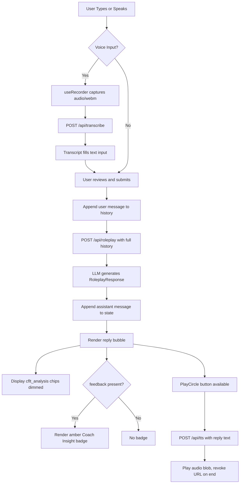

# Roleplay Coach

> Feature spec for the CoreFirst Roleplay Coach.
> Theoretical reference: [cflt.center](https://cflt.center) (CFLT framework manifesto, separate repository).

## Purpose

The Roleplay Coach is an AI-driven conversational module that serves as the **output stage** of the CoreFirst learning journey. After learners discover Core-First Language Theory through the **Logic Transformer** (ad-hoc sentence analysis) and reinforce it through **Course** (structured, scaffolded practice), the Roleplay Coach provides a free, multi-turn dialogue environment where they apply acquired CFLT structure in natural, open-ended conversation. The coach monitors the user's logic sequencing in real time, delivers targeted coaching feedback when deviations occur, and annotates its own replies with CFLT block analysis — keeping the four-element sequence `[Core Action/Result] → [Condition/Reason] → [Space/Context] → [Time]` visible at every turn.

## Scope

**Included:**
- **Multi-Turn Dialogue:** Maintaining the full message history in memory and passing it as context to the LLM on every turn.
- **CRST Enforcement:** Detecting deviations in the user's logic sequence and generating targeted, natural-language coaching feedback.
- **CRST Self-Annotation:** Each AI reply includes a `coach_analysis` object that exposes the coach's own CRST block structure, reinforcing the method by example. The user's turn carries a parallel `user_analysis` block with corrections, error list, and CRST decomposition.
- **Session Persistence:** Every session is upserted as a per-event PouchDB document; every message (user and assistant) is stored as its own event document with `userAnalysis`, `coachAnalysis`, `feedback`, and CAS audio references.
- **Session History UI:** `RoleplayHistory` lists every past session with message counts and timestamps; each row exposes Rename / Delete; each message exposes a Delete button.
- **TTS Playback:** Playing AI messages aloud via `/api/tts`, with a per-message `ssml` field providing prosody hints that emphasize Core blocks.
- **Voice Input + Corrected-Voice Output:** Recording user speech via `useRecorder` and transcribing it through `/api/transcribe`; on submit, the user's original voice blob is saved to the CAS pool (`audioFile`), and the coach's corrected sentence is TTS'd and also stored (`correctedAudioFile`) so the learner can compare.
- **Context Injection:** An optional free-text `context` field (e.g., "Job interview at a tech company") that steers the scenario without changing the coaching rules. The session's `context` is editable post-hoc via Rename.

**Excluded:**
- **VoiceChallenge on AI Replies:** Pronunciation evaluation of AI-generated text is not implemented in the current phase.
- **Cross-Mode Vocabulary Update** *(Phase 3)*: Propagating vocabulary from AI responses to the SRS deck is deferred.
- **Automatic Course Suggestions** *(Phase 3)*: Post-conversation weak-pattern detection triggering targeted Course recommendations is deferred.

## Core Responsibilities

1. **Conversation Management** — Accumulate `Message[]` in component state; serialize the full history to JSON and pass it as the LLM prompt on every turn, preserving conversational continuity.
2. **CFLT Enforcement** — The system prompt instructs the LLM to detect when the user's response does not follow the Core-First sequence and to populate the `feedback` field with a targeted correction. When the user's logic is correct, `feedback` is `null`.
3. **CFLT Self-Annotation** — Each AI response includes `cflt_analysis` (the coach's own reply decomposed into CFLT blocks) and `ssml` (an SSML-tagged version of the reply with prosody emphasis on the Core block), surfaced in the message bubble.
4. **Voice Input Pipeline** — `useRecorder` captures audio via the browser MediaRecorder API (`audio/webm`); on `stop`, the blob is POSTed to `/api/transcribe`; the returned transcript is written into the text input field for user review before sending.
5. **TTS Output** — When the user taps the PlayCircle button, the raw reply text is POSTed to `/api/tts`; the returned audio blob is played via a transient `Audio` object with automatic URL revocation on completion.

## Interfaces

### Inputs
`RoleplayRequestSchema` (validated in `app/api/roleplay/route.ts`):
- `messages` — array of `{ role: 'user' | 'assistant', content: string }` representing the full conversation history
- `sourceLang` — learner's native language (must be a member of `ALLOWED_LANGUAGES`)
- `targetLang` — practice language (must be a member of `ALLOWED_LANGUAGES`)
- `context` *(optional)* — free-text scenario description; sanitized of control characters and capped at `MAX_CONTEXT_LEN` (500 chars) before prompt injection

### Outputs

Two response shapes depending on `analysisEnabled`:

**Full** (`RoleplayResponseSchemaFull` — when analysis is on):
- `reply` (string) — the coach's standard conversational response in the target language
- `ssml` (string) — SSML-tagged version of `reply` with prosody emphasis on Core blocks
- `user_analysis` — `{ corrected, errors[], crst: {core, reason, space, time}, standard_l1 }` decomposition of the user's last turn
- `coach_analysis` — `{ crst, standard_l1 }` decomposition of the coach's own reply
- `feedback` (string | null) — targeted coaching note when the user's logic deviated; `null` if compliant
- `session_title` (string | optional) — 5–10-word summary in `sourceLang`, used as the session's `context` when the user didn't supply one
- `audioFile` / `correctedAudioFile` (strings, returned alongside the parsed body) — CAS pool filenames for the user's original recording and the coach's TTS'd correction

**Lean** (`RoleplayResponseSchemaLean` — analysis off):
- `reply`, `ssml`, `feedback`, `session_title` only — no per-CRST decomposition

### Edit / Delete API

- `PATCH /api/history/roleplay/sessions/[sessionId]?slug=<slug>` body `{ context: string }` → rename session
- `DELETE /api/history/roleplay/sessions/[sessionId]?slug=<slug>` → cascade-delete session metadata + every message via prefix scan + `bulkDocs` tombstone
- `DELETE /api/history/roleplay/messages/[eventId]` → tombstone one message; session and other messages preserved
- All deletes are idempotent (404 → 200)

### Dependencies
- **Text Provider** — the `roleplay` feature uses `roleplayModel` from `src/lib/ai/`; resolved via `ROLEPLAY_PROVIDER` / `ROLEPLAY_MODEL` > `TEXT_PROVIDER` / `TEXT_MODEL` > baked-in default (`google` + `gemini-3-flash-preview`). Used with `generateObject` (Vercel AI SDK) to guarantee structured output conforming to `RoleplayResponseSchema`. Subscription CLIs (`cli/claude`, `cli/gemini`) are also valid.
- **Transcription API** — `/api/transcribe` uses `experimental_transcribe` (Vercel AI SDK) with `sttModel` from `src/lib/ai/`; accepts `multipart/form-data` with an `audio` Blob up to 10 MB.
- **TTS API** — `/api/tts` accepts `{ text: string }` and returns an audio Blob; consumed by the `playAudio` callback in `CFLTChat`.
- **`useRecorder` hook** — `hooks/useRecorder.ts`; wraps `navigator.mediaDevices.getUserMedia` and `MediaRecorder`; exposes `{ isRecording, audioBlob, recorderError, startRecording, stopRecording }`.
- **`CFLTBlock` component** — renders CFLT chip sets used in other modes; available for future integration in this view.

## Data Flow

## Key Behaviors

### Inline Coaching Without Interruption
The coach delivers CFLT feedback (`feedback` field) as a non-blocking amber badge labeled **Coach Insight** beneath the reply bubble. Conversation flow continues uninterrupted; the user is never blocked from replying.

### CFLT Transparency by Example
Every AI reply surfaces its own CFLT block decomposition as small chips below the bubble, initially dimmed (`opacity-60`) and fully visible on hover (`opacity-100`). This provides passive exposure to correct Core-First sequencing even when the user does not request analysis.

### Voice-to-Text Review Gate
The transcription result pre-fills the text input but does not auto-send. The user retains full editorial control — they can edit, discard, or confirm the transcript before submitting. This prevents transcription errors from entering the conversation history.

### Conversation Length Guard
The server passes only the last 10 messages as LLM context (`messages.slice(-10)`). The client warns when the visible conversation grows beyond 12 messages — *"Tip: the AI uses only the last 10 messages"* — with a "New Conversation" shortcut. At 20+ messages the warning escalates. The `MAX_MESSAGES_JSON_LEN = 8192` constant is defined but not enforced at the HTTP layer (historical; the slice guard is sufficient).

### CFLT Build Mode (Pre-Production Scaffold)
A "Build" toggle in the header switches the input area from a free-text field to a four-slot structured form: **Core / Reason / Space / Time**, each colour-coded to match the CFLT block palette. The user fills whichever slots apply and clicks Send; the client assembles them with comma separators and submits to `/api/roleplay` as normal text. The AI coach receives and evaluates the CFLT-ordered message exactly as it would a free-text message — enabling structure-before-output training without any server change.

### BYOK Headers on All AI Routes
All fetch calls within `CFLTChat` — `/api/roleplay`, `/api/transcribe`, and `/api/tts` — include the `x-cf-*` headers from `useSettings().getHeaders()`. If the user has configured a provider in Settings, Roleplay uses it automatically.

### Context Sanitization
The optional `context` string is stripped of all ASCII control characters (`\x00–\x1F`, `\x7F`) and truncated to 500 characters before interpolation into the system prompt, preventing prompt injection via the scenario field.

### Per-Event Persistence (Sync-Safe)

Each `upsertRoleplaySession` call writes/updates the session metadata doc (keyed by `sessionId`) and then appends each new message as **its own PouchDB document** with the ID pattern `<slug>:roleplay-msg:<sessionId>:<isoTime>:<rand>`. Two devices replying in the same session at the same time produce distinct message docs that merge naturally during sync — no `_conflicts` to resolve, no lost writes.

### Session-Level Rename / Delete

`renameRoleplaySession` runs `mutate()` on the session metadata doc — atomic, conflict-safe, and only updates the `context` field (sessionId and slug are immutable join keys).

`deleteRoleplaySession` runs `listByPrefix(EVENTS, '<slug>:roleplay-msg:<sessionId>:')` then bulk-tombstones every message doc plus the metadata doc in a single `bulkDocs` round-trip. Tombstones replicate across devices via PouchDB's normal sync.

## Constraints

- **`MAX_MESSAGES_JSON_LEN`:** 4096 bytes — maximum allowed size of the JSON-serialized message history per request.
- **`MAX_CONTEXT_LEN`:** 500 characters — maximum length of the injected scenario context after sanitization.
- **`ALLOWED_LANGUAGES`:** `{ Chinese, English, Japanese, Spanish, French, German }` — both `sourceLang` and `targetLang` must be members of this set; all other values return `HTTP 400`.
- **Audio upload limit:** 10 MB per request to `/api/transcribe`.
- **Persistence**: Sessions and messages are written to PouchDB as per-event docs (`events` collection); React state is the cache, not the source of truth. Page reload reloads from `GET /api/history/roleplay`.

## Error Handling

- **Missing / Invalid API Key:** `/api/roleplay` returns `HTTP 401` with `{ error: 'API_KEY_REQUIRED' | 'INVALID_API_KEY' }`. `CFLTChat` detects the status, sets `keyError`, and renders an amber banner with an "Open Settings →" link. Resolved as soon as the user configures a valid key in Settings.
- **LLM / Coach Unavailable:** If `/api/roleplay` returns any other non-`200` status, the UI appends an inline assistant message: *"Coach unavailable. Please try again."* — no modal or page-level error is shown.
- **Microphone Permission Denied:** `useRecorder` catches `getUserMedia` failures and sets `recorderError`; the error string is rendered in red above the input area. The text input and send button remain functional.
- **Transcription Failure:** If `/api/transcribe` returns an error, the failure is logged to the console and the text input is left empty; the user can type their message manually.
- **TTS Failure:** If `/api/tts` returns an error, playback silently fails; the error is logged to the console and the `audioLoading` spinner is cleared. No disruptive UI feedback is shown, as audio is an enhancement rather than a required interaction path.
- **Unsupported Language:** `/api/roleplay` returns `HTTP 400` with `{ error: 'Unsupported language' }` if either language is outside `ALLOWED_LANGUAGES`.
- **Long Conversation:** The server silently applies `messages.slice(-10)` — no HTTP error. The client informs the user via the length-guard banner so they can start a new session if they need full continuity.

## Phased Rollout

| Phase | Capability |
|-------|-----------|
| **Current** | Multi-turn dialogue with full CRST analysis (user + coach), CFLT Build Mode pre-production scaffold, BYOK headers on all sub-calls, per-event PouchDB persistence, session list + rename + cascade delete + per-message delete, voice input + corrected-voice TTS, multi-user partitioning |
| **Phase 2** | VoiceChallenge on AI replies — pronunciation evaluation of coach-generated text |
| **Phase 3** | Post-conversation weak-pattern detection → targeted Course suggestions; AI vocabulary → SRS deck capture |
| **Phase 4** | Live multi-device sync via SaaS registry (PouchDB infrastructure ready; replication endpoint outstanding) |
