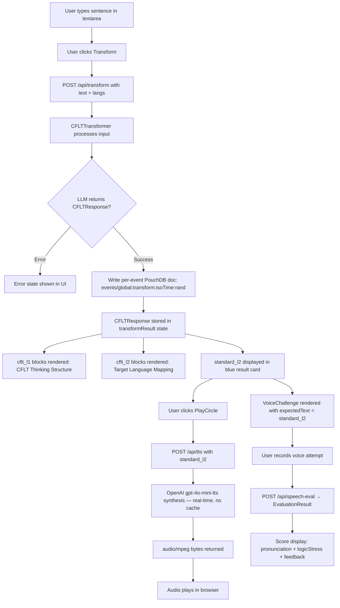

# Transform Mode

> Feature spec for the CoreFirst Transform Mode user experience.
> Theoretical reference: [cflt.center](https://cflt.center) (CFLT framework manifesto, separate repository).
> Related: [Logic Transformer Engine](./logic-transformer.md) covers the AI processing unit that Transform Mode invokes.

## Purpose

Transform Mode is the discovery entry point of the CoreFirst learning journey. A learner types any sentence in their native language, clicks Transform, and immediately sees that sentence restructured into the CFLT four-element sequence (`[Core Action/Result] → [Condition/Reason] → [Space/Context] → [Time]`) alongside a token-swapped target-language mapping and a polished idiomatic output. TTS playback and a `VoiceChallenge` panel follow inline, so the learner can hear and practice the discovered sentence without leaving the view. Transform Mode is deliberately lightweight and ad-hoc: it requires no topic selection, no course enrollment, and — in Phase 1 — no account. It is the fastest path from a thought to a spoken, CFLT-structured sentence.

**Relationship to Logic Transformer Engine:** `logic-transformer.md` describes the AI processing unit (`CFLTTransformer`, `POST /api/transform`, `CFLTResponseSchema`) that converts raw input into structured CFLT output. This document describes the end-to-end user interaction layer built on top of that engine: the input form, the CFLT block rendering, the TTS Play button, the VoiceChallenge integration, the history persistence strategy, and the phased cross-mode connection plan.

## Scope

**Included:**
- **Text Input and Submission:** A freeform textarea accepting native-language input (up to 8,192 characters) and a Transform button that POSTs to `/api/transform`.
- **CFLT Block Display:** Visual rendering of `cflt_l1` (native-language CFLT sequence) and `cflt_l2` (target-language token-swapped sequence) as color-coded blocks in the `CFLTBlock` component pattern, labeled "CFLT Thinking Structure" and "Target Language Mapping" respectively.
- **Standard Output Display:** The polished idiomatic `standard_l2` string rendered as a prominent quote inside a blue card, with a `PlayCircle` TTS button.
- **TTS Playback:** Clicking the `PlayCircle` button POSTs `standard_l2` to `/api/tts` and plays the returned `audio/mpeg` stream. Audio loading state is tracked per-call to disable the button while synthesis is in progress.
- **VoiceChallenge Practice:** After the result is displayed, a `VoiceChallenge` component is rendered with `expectedText = standard_l2`, giving the learner an immediate opportunity to record and receive a CFLT prosody evaluation.
- **Transform History:** Each successful `/api/transform` response is persisted as its own per-event PouchDB document in the `events` collection, ID-prefixed `<slug>:transform:<isoTime>:<rand>` (or `global:transform:…` for ad-hoc usage outside a course). Doc carries `{type, slug, createdAt, data: {inputText, sourceLang, targetLang, cfltL1, cfltL2, standardL2, createdAt}}`. History is viewable from the History panel; each entry exposes a Delete button (`DELETE /api/history/transforms/[eventId]`).
- **Multi-user partitioning:** Every operation takes a `userId` (resolved from `X-User-Id` header → `cf_user_id` cookie → env → `'local'`); each user's transforms live in their own PouchDB instance under `data/users/<userId>/records/db_events/`.

**Excluded:**
- **Cross-Mode Suggestions (Phase 3):** Topic detection and "Generate a Course on this topic" prompts are not present in Phase 1. Vocabulary annotation of recognized `cflt_l2` tokens against the SRS deck is also Phase 3.
- **Vocabulary Tagging (Phase 2):** Surfacing mastery level indicators inline with individual CFLT block tokens is a Phase 2 capability dependent on the SRS deck being populated.
- **Per-Element CFLT Voice Scores (Phase 2):** `VoiceChallenge` renders Phase 1 scores only (`overallScore`, `pronunciation`, `logicStress`). The four per-block CFLT sub-scores (`scoreCoreAction`, `scoreCondition`, `scoreSpaceContext`, `scoreTime`) are reserved for Phase 2.

## Core Responsibilities

1. **Input Collection and Validation** — Accepts freeform native-language text, enforces the 8,192-character limit, and dispatches the Transform request on user action.
2. **CFLT Result Rendering** — Parses and displays the four-element `cflt_l1` and `cflt_l2` structures as labeled block sequences, and presents `standard_l2` as the polished target output.
3. **Audio Playback Orchestration** — Manages per-sentence TTS loading state and Audio object lifecycle, routing requests through `/api/tts` and playing the response stream in the browser.
4. **VoiceChallenge Integration** — Mounts the `VoiceChallenge` component below the result with the correct `expectedText`, `sourceLang`, and `targetLang` props, enabling immediate spoken practice without navigation.
5. **History Persistence** — Writes every successful Transform call as a per-event PouchDB document in the user's `events` collection. Sync-safe across devices (each transform is its own doc — no array-of-transforms RMW conflicts). The eventId is surfaced to the UI for targeted delete.
6. **History Editing** — Exposes Delete on every transform history entry via `DELETE /api/history/transforms/[eventId]`. Idempotent; tombstones replicate across devices.

## Interfaces

### User Inputs
| Input | Location | Description |
|-------|----------|-------------|
| Native-language sentence | Textarea on Transform tab | Freeform text, any length up to 8,192 characters. |
| Source language selector | Mode controls | Defaults to `Chinese`; parameterizes both the transformer prompt and the phonetic migration feedback in speech-eval. |
| Target language selector | Mode controls | Defaults to `English`. |
| Transform button | Below textarea | Triggers `POST /api/transform`. Disabled while a request is in flight. |

### `POST /api/transform`
- **Request:** `{ text: string, sourceLang?: string, targetLang?: string }` (validated by `TransformRequestSchema` via Zod).
- **Response:** `CFLTResponse` JSON (validated by `CFLTResponseSchema` in `src/types/cflt.ts`) on success; `{ error: string }` with HTTP 400 or 500 on failure.
- **`CFLTResponse` fields:**

| Field | Type | Description |
|-------|------|-------------|
| `is_cflt_compliant` | `boolean` | Whether the original input already followed the CFLT sequence. |
| `cflt_l1` | `string` | Input restructured into the Core-First sequence in the native language. |
| `cflt_l2` | `string` | Token-swapped CFLT output in the target language. |
| `standard_l2` | `string` | Polished idiomatic target-language sentence. |
| `standard_l1` | `string` | Back-translated native reference confirming the AI understood the intent. |
| `corrections` | `Correction[]` | Array of `{ type: 'logic' \| 'grammar' \| 'vocabulary', original, replacement, reason }` objects. |

### `POST /api/tts`
Invoked when the learner clicks the `PlayCircle` button on the `standard_l2` card.
- **Request:** `{ text: string }` — `standard_l2` from the transform result.
- **Response:** Raw `audio/mpeg` bytes, played via a browser `Audio` object.
- **Loading State:** A per-sentence `audioLoading` key (`'transform-result'`) tracks in-flight requests; the button renders a `Loader2` spinner while loading and is disabled to prevent double-submission.

### `VoiceChallenge` Component (mounted after result)
Receives:
- `expectedText = transformResult.standard_l2`
- `sourceLang` — from the active source language selection
- `targetLang` — from the active target language selection
- No `packageId` in Phase 1 (Transform Mode does not produce a `.corefirst` package; voice attempts from Transform Mode reference `transformRecordId` in Phase 3 when the `.cfrecord` transform entry becomes the anchor)

### Dependencies
- **Logic Transformer Engine** — `CFLTTransformer` in `src/core/transformer.ts`; see `docs/features/logic-transformer.md`.
- **TTS Factory** — `TTSFactory` in `src/core/tts/factory.ts`; default `OpenAITTSProvider` using `gpt-4o-mini-tts`. TTS is cached per-user in the CAS pool (`data/users/<userId>/media/<hash>.mp3`) — same `standard_l2` text produces a cache hit and skips synthesis.
- **PouchDB `events` collection** — Per-event documents are the persistence target. `appendTransform(userId, slug, data)` writes a new doc; `listTransformEvents(userId)` enumerates; `deleteHistoryEvent(userId, eventId)` removes one.

### Edit / Delete API

- `DELETE /api/history/transforms/[eventId]` → tombstone one transform doc. Idempotent (404 → 200). Tombstone replicates across devices via PouchDB sync.
- No PATCH — transforms are immutable historical events. To "edit" a transform, delete it and submit a new one.

## Data Flow

## Key Behaviors

### CFLT Block Visualization
The `cflt_l1` and `cflt_l2` strings are rendered as sequences of visually distinct, labeled blocks by the `renderBlocks` function. Each block corresponds to one CFLT element — `[Core Action/Result]`, `[Condition/Reason]`, `[Space/Context]`, `[Time]` — and is color-coded to reinforce the structural mapping between native and target language. The two block rows are stacked with a horizontal divider between them, making the token-swap relationship spatially apparent.

### Immediate Practice Loop
Transform Mode is designed so that the learner can complete a full exposure-to-practice cycle in a single screen without navigation:
1. Type sentence → see CFLT restructuring (cognitive mapping)
2. Click Play → hear the sentence (auditory anchoring)
3. Click mic → record and receive score (production practice)

This loop can be repeated on the same sentence to improve `logicStress` or `pronunciation` scores, or the learner can type a new sentence to start the cycle again.

### Resilient Lightweight Operation
`/api/transform` instantiates `CFLTTransformer`, calls `transform()`, returns the result, and then `appendTransform(userId, packageSlug ?? null, …)` writes a per-event doc as a background fire-and-forget. This makes Transform the fastest and most resilient endpoint in the system — safe to experiment with new prompt variants. History persistence is not a prerequisite for the response; a write failure is logged but never surfaced to the user.

### Sync-Safe by Construction
Each transform is its own document with a stable ID. Two devices submitting transforms at the same time produce distinct doc IDs that merge cleanly during PouchDB replication — no `_conflicts`, no lost writes.

### Language Pair Parameterization
Both `sourceLang` and `targetLang` are passed through to the transformer and to the `VoiceChallenge` component. `sourceLang` is particularly significant: when set to `Chinese`, the `speech-eval` evaluator generates Pinyin-anchored phonetic migration feedback, leveraging the learner's existing phonological knowledge to bridge to English pronunciation.

### Cover & Recall (Self-Test Mode)
After the standard-L2 result is displayed, a **"Test Yourself"** button hides the answer and presents a free-text field. The learner attempts to reproduce the target-language sentence from the CFLT structure blocks above. Clicking **"Reveal Answer"** shows their attempt alongside the correct sentence side-by-side. This shifts engagement from passive reading to active production. Resets automatically when a new transform is performed.

### Phonetic Bridge
For `sourceLang === 'Chinese'`, a collapsible **Pinyin → IPA Reference** panel renders below VoiceChallenge (`components/PhoneticBridge.tsx`). Groups sounds by category (stops, retroflexes zh/ch/sh/r, palatals j/q/x, vowels, common mistake pairs); searchable by Pinyin, IPA, or English keyword. Visually marks tricky sounds that have no close English equivalent. Invisible for all other source languages.

### Post-Result CTAs
Two navigation shortcuts appear below the transform result:
- **"Build a course on this →"** — pre-fills the Course tab topic with the current input sentence and switches to Course mode.
- **"Practice in Roleplay →"** — switches to the Roleplay tab so the learner can immediately use the sentence in open-ended conversation.

## Constraints

- **Input Length:** 8,192 characters maximum, validated by `TransformRequestSchema` at the API layer. Inputs exceeding this limit receive a `400` response before any LLM call is made.
- **TTS Length:** 4,096 characters maximum per `/api/tts` request (`MAX_TTS_LEN` in `/api/tts/route.ts`). `standard_l2` output is well within this limit for typical sentences.
- **Language Pair Validation:** Chinese↔English is the production-validated pair with test vectors in `tests/core/test_vectors.md`. Other language pairs are supported by the prompt template but are not declared production-ready until their own test vectors are added.
- **Cross-Mode CTAs Shipped:** "Build a course on this →" and "Practice in Roleplay →" shortcuts are available; full vocabulary cross-linking is Phase 3.

## Error Handling

- **Empty or Oversized Input:** The Transform button is disabled (or `TransformRequestSchema` rejects) for empty strings or inputs exceeding 8,192 characters. A `400` response with `'Invalid request: text is required (max 8 KB)'` is returned.
- **LLM Transformation Failure:** If `CFLTTransformer.transform()` returns an `{ error }` object or throws, the route returns `500 Transformation failed`. The UI renders an inline error state and the result card is not shown.
- **TTS Generation Failure:** `/api/tts` returns `500 TTS generation failed`. The `PlayCircle` button exits its loading state; the learner can retry without losing the transform result.
- **VoiceChallenge Errors:** Microphone permission errors and evaluation failures are handled within the `VoiceChallenge` component and displayed inline below the result card. They do not affect the Transform result display.
- **History Write Failure:** `appendTransform` failures are logged server-side but do not cause the API response to fail. The learner receives their CFLT result even if the history entry could not be persisted.
- **History Delete:** `deleteHistoryEvent` is idempotent — concurrent multi-device deletes (or retries) never return an error.

## Phased Rollout

| Phase | Transform Mode additions |
|-------|--------------------------|
| **Phase 1 — Foundation (current)** | Full CRST display, TTS playback w/ CAS cache, VoiceChallenge, per-event PouchDB history, Cover & Recall self-test, Phonetic Bridge (Chinese), post-result CTAs (→ Course, → Roleplay), multi-user partitioning, History tab |
| **Phase 2 — Progress Tracking** | `VoiceChallenge` renders four per-block CRST sub-scores (`scoreCoreAction`, `scoreCondition`, `scoreSpaceContext`, `scoreTime`) once the Phase 2 evaluator prompt is deployed |
| **Phase 3 — Cross-mode Integration** | Vocabulary mastery annotations on `cflt_l2` blocks from SRS deck; "Generate a Course on this topic" prompt surfaced after transform result; `standardL2` tokens upserted to SRS with Transform-mode mastery weight |
| **Phase 4 — CRST Profiling and Sync** | Per-user CRST weakness radar incorporates Transform Mode voice attempt sub-scores; SM-2 review schedule surfaces weak vocabulary as Transform input suggestions; live multi-device sync via cloud registry |
