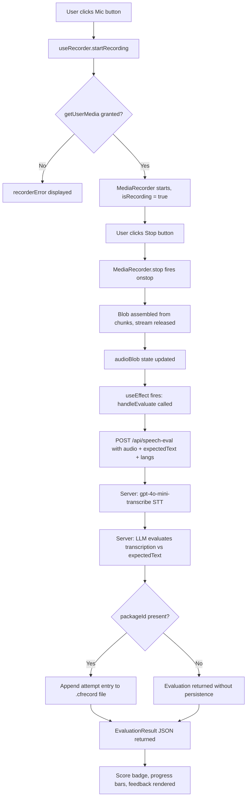

# Voice Challenge

> Feature spec for the CoreFirst Voice Challenge component.
> Theoretical reference: [cflt.center](https://cflt.center) (CFLT framework manifesto, separate repository).

## Purpose

The Voice Challenge is a reusable React component that closes the perception-production gap in CFLT learning. It gives learners an immediately available opportunity to speak any sentence they have just encountered — in Transform Mode, after a Course puzzle unlock, or during Roleplay — and receive instant, CFLT-aware feedback. The pipeline is: browser audio recording → server-side STT transcription (`gpt-4o-mini-transcribe`) → LLM evaluation against the expected sentence and CFLT criteria → structured score display. All processing is stateless from the component's perspective: the component posts audio and receives scores; persistence, when present, is the responsibility of the calling mode.

## Scope

**Included:**
- **Audio Recording:** Browser-native MediaRecorder API, wrapped in the `useRecorder` hook (`hooks/useRecorder.ts`). Captures `audio/webm` blobs.
- **Auto-Submission:** The component listens on the `audioBlob` signal from `useRecorder`; when a new blob is ready the evaluation POST fires automatically — no secondary user action required.
- **STT Transcription:** Audio is transcribed server-side by `gpt-4o-mini-transcribe` (via the Vercel AI SDK `experimental_transcribe` call inside `/api/speech-eval`).
- **LLM Evaluation:** Transcription and expected text are sent to the configured LLM. The evaluator returns three Phase 1 scoring dimensions (`overallScore`, `pronunciation`, `logicStress`) and a natural-language coaching feedback string.
- **Score Display:** Animated progress bars for `pronunciation` and `logicStress`, overall score badge, and LLM feedback rendered in the component.
- **TTS Playback:** For Course Mode, audio is read directly from the pre-rendered `audio/*.mp3` files bundled inside the `.corefirst` package — no API call is made. For Transform and Roleplay modes, the `/api/tts` route generates audio in real time via the OpenAI `gpt-4o-mini-tts` model (via `TTSFactory`).
- **Mic Release on Unmount:** The `useRecorder` cleanup function stops all MediaStream tracks when the component unmounts, ensuring no microphone lock persists after navigation.
- **Phase 2 Scoring Dimensions:** `scoreCoreAction`, `scoreCondition`, `scoreSpaceContext`, `scoreTime` are reserved fields in the `.cfrecord` attempt entry for Phase 2. They require an extended `speech-eval` system prompt and are absent from Phase 1 score display.

**Excluded:**
- **Audio Persistence:** Raw audio blobs are not stored anywhere; only the evaluation scores and transcription text are persisted. (**Phase 1**; no planned Phase for raw audio storage.)
- **Per-Element CFLT Scoring in UI:** `scoreCoreAction` / `scoreCondition` / `scoreSpaceContext` / `scoreTime` are schema-ready but not rendered or computed until the Phase 2 evaluator prompt is deployed.
- **Standalone Transcription Route:** The `/api/transcribe` route provides raw STT for Roleplay Mode text input; it is not used by `VoiceChallenge`, which bundles transcription and evaluation into a single `/api/speech-eval` call.

## Core Responsibilities

1. **Recording Lifecycle Management** — Exposes start/stop controls, delegates all MediaRecorder state to the `useRecorder` hook, and resets prior evaluation results when a new recording begins.
2. **Automatic Evaluation Dispatch** — Reacts to `audioBlob` becoming non-null and dispatches a `multipart/form-data` POST to `/api/speech-eval` without requiring additional user interaction.
3. **CFLT-Aware Score Presentation** — Renders the three Phase 1 dimensions with labeled progress bars and surfaces the LLM's phonetic-migration coaching as a readable italic quote.
4. **Error Surface** — Distinguishes between recorder-level errors (microphone permission denied, device unavailable) and evaluation-level errors (network failure, LLM timeout) and displays the appropriate message inline.

## Interfaces

### Props (`VoiceChallengeProps`)
| Prop | Type | Required | Description |
|------|------|----------|-------------|
| `expectedText` | `string` | Yes | The canonical target-language sentence the learner is attempting to reproduce. Sent verbatim to `/api/speech-eval`. |
| `sourceLang` | `string` | Yes | Learner's native language (e.g., `Chinese`). Used by the evaluator to generate Pinyin-referenced phonetic migration hints. |
| `targetLang` | `string` | Yes | Target language being practiced (e.g., `English`). |
| `packageId` | `string` | No | Course Mode package identifier. When present, the server appends a voice attempt entry to the `.cfrecord` file anchored to the parent package. Absent in Transform Mode Phase 1. |

### Evaluation Result (`EvaluationResult`)
Returned by `POST /api/speech-eval` as JSON:
| Field | Type | Description |
|-------|------|-------------|
| `score` | `number` | Overall composite score, 0–100. |
| `pronunciation` | `number` | Phonetic accuracy score, 0–100. |
| `logic_stress` | `number` | Prosodic emphasis on the `[Core Action]` block, 0–100. |
| `transcription` | `string` | STT-transcribed text of the learner's utterance. |
| `feedback` | `string` | Natural-language coaching note, with Pinyin migration hints for Chinese learners. |

### Phase 2 Scoring Dimensions (reserved, not yet active)
These fields will be added to `EvaluationResult` and the `.cfrecord` attempt entry once the Phase 2 evaluator prompt is deployed:
| Field | CFLT Element |
|-------|-------------|
| `scoreCoreAction` | `[Core Action/Result]` |
| `scoreCondition` | `[Condition/Reason]` |
| `scoreSpaceContext` | `[Space/Context]` |
| `scoreTime` | `[Time]` |

### `/api/speech-eval` — POST
- **Request:** `multipart/form-data` with fields `audio` (Blob, ≤ 10 MB), `expectedText` (string), `sourceLang`, `targetLang`, and optional `packageId`.
- **Response:** `EvaluationResult` JSON or `{ error: string }` with an appropriate HTTP status.
- **Side Effect:** If `packageId` is provided, a voice attempt entry is appended to the `.cfrecord` file (Phase 1 fields: `overallScore`, `pronunciation`, `logicStress`; Phase 2 adds the four per-block scores).

### `/api/tts` — POST
- **Request:** `{ text: string }` JSON, max 4,096 characters.
- **Response:** Raw `audio/mpeg` bytes.
- **Usage:** Called in real time for Transform and Roleplay modes. Not called during Course Mode playback — Course audio is served from the pre-rendered `audio/*.mp3` files bundled in the `.corefirst` package.

### `useRecorder` Hook
Returned values:
| Value | Type | Description |
|-------|------|-------------|
| `isRecording` | `boolean` | Whether the MediaRecorder is currently active. |
| `audioBlob` | `Blob \| null` | The most recently completed recording. Set on `onstop`; reset to `null` on `startRecording`. |
| `recorderError` | `string \| null` | Human-readable error from `getUserMedia` or MediaRecorder. |
| `startRecording` | `() => Promise<void>` | Requests mic permission, initializes MediaRecorder with `audio/webm`, and starts recording. |
| `stopRecording` | `() => void` | Calls `MediaRecorder.stop()`; `onstop` assembles the blob from accumulated chunks and releases the stream. |

## Data Flow

## Key Behaviors

### Automatic Evaluation on Recording Stop
The component uses a `React.useEffect` that depends on `audioBlob`. When `stopRecording` is called, the MediaRecorder's `onstop` handler assembles the blob from accumulated chunks and updates `audioBlob` state. The effect fires synchronously on the next render cycle, calling `handleEvaluate` with the new blob. The learner never needs to press a separate "Submit" button.

### Prior Result Cleared on New Recording
At the start of `handleEvaluate`, `setEvaluation(null)` is called before the fetch. This prevents the previous attempt's scores from being visible while the new evaluation is in flight, giving the learner a clean slate.

### Logic Stress: CFLT-Specific Prosody Signal
`logic_stress` (mapped to `logicStress` in the DB) measures whether the learner placed natural prosodic emphasis on the `[Core Action/Result]` block — the first and most cognitively significant element in the CFLT sequence. A high pronunciation score with a low logic stress score signals that the learner is saying the words correctly but speaking them with the inherited prosody of their native language, rather than the Core-First emphasis pattern.

### Phonetic Migration Feedback
When `sourceLang` is `Chinese`, the evaluator system prompt instructs the LLM to anchor phonetic correction notes to Pinyin. For example: "To fix your /v/, start with Pinyin 'f' but vibrate your cords." This approach bridges the learner's existing phonological knowledge rather than introducing abstract IPA notation.

### TTS Audio: Bundled vs. Real-Time
Course Mode audio is pre-rendered at package generation time and stored as `audio/{scriptIndex}.mp3` inside the `.corefirst` ZIP. Playback reads directly from the package file — no TTS API call is made and no caching is needed. For Transform and Roleplay modes, `/api/tts` is called in real time on demand; the sentences in these modes are unpredictable and user-specific, so a cache would rarely hit and is not implemented.

### Mic Release on Unmount
The `useRecorder` cleanup effect (`useEffect` returning a destructor) calls `MediaRecorder.stop()` and iterates `MediaStream.getTracks().forEach(t => t.stop())`. This ensures the browser's "microphone in use" indicator is cleared when the learner navigates away or the component is removed from the DOM.

### BYOK Headers
`VoiceChallenge` calls `useSettings().getHeaders()` and includes the resulting `x-cf-*` headers on every `POST /api/speech-eval` request. If the user has configured a text-AI provider in Settings, speech evaluation uses it automatically. The `handleEvaluate` function is wrapped in `useCallback` with the headers dependency for stable referential identity.

## Constraints

- **Audio File Size:** Maximum 10 MB per recording (`MAX_AUDIO_BYTES` in `/api/speech-eval/route.ts`). Recordings that exceed this limit receive a `400` response.
- **Supported Formats:** `audio/webm`, `audio/mp4`, `audio/wav`, `audio/mpeg`, `audio/ogg`. The `useRecorder` hook produces `audio/webm` by default on all browsers that support MediaRecorder.
- **TTS Input Length:** Maximum 4,096 characters per `/api/tts` request.
- **Phase 2 Sub-Scores:** `scoreCoreAction`, `scoreCondition`, `scoreSpaceContext`, `scoreTime` in `.cfrecord` attempt entries are omitted from Phase 1 application logic. The evaluator prompt change that enables them must be deployed atomically with the Phase 2 UI update.

## Error Handling

- **Missing / Invalid API Key:** `/api/speech-eval` returns `HTTP 401`. The component detects the status, sets `keyError`, and displays an amber inline message: *"No API key configured for speech evaluation. Open Settings to add one."*
- **Microphone Permission Denied:** `getUserMedia` rejection is caught in `startRecording`; the error message is surfaced via `recorderError` and displayed inline with an `AlertCircle` icon.
- **Unsupported Format:** `/api/speech-eval` returns `400 Unsupported audio format` if the `audioFile.type` is not in `ALLOWED_AUDIO_TYPES`.
- **File Size Exceeded:** `/api/speech-eval` returns `400 Audio file exceeds 10 MB limit` before any transcription is attempted.
- **STT Failure:** An exception from `experimental_transcribe` propagates to the outer `try/catch` in the route; a `500 Speech evaluation failed` response is returned and `evalError` is set in the component.
- **LLM Evaluation Failure:** `generateObject` failures are caught at the route level; the same `500` response is returned.
- **File Write Failure:** Attempt persistence errors when writing to `.cfrecord` are caught in an inner `try/catch` and logged to `console.error('[speech-eval] Failed to persist attempt:', err)`. The evaluation result is still returned to the client — a file write failure does not cause the user-facing response to fail.
