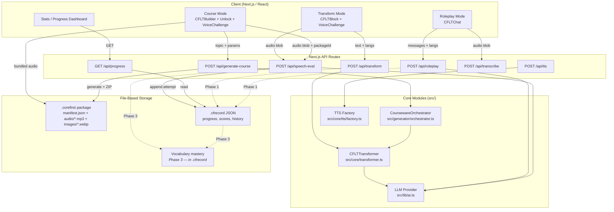

# CoreFirst Learning Architecture

> Architecture overview for the CoreFirst three-mode learning system.
> Theoretical reference: [cflt.center](https://cflt.center) (CFLT framework manifesto, separate repository).

## Purpose

This document describes the end-to-end learning architecture of **CoreFirst**: how the three learning modes (Transform, Course, Roleplay) relate to each other, how data flows between them, how vocabulary mastery is shared across modes, and how the cross-mode integration deepens across the four implementation phases.

## Scope

**Included:**
- The pedagogical role and data contract of each mode.
- The directed learning journey from discovery through structured practice to free application.
- Shared data structures and the vocabulary mastery model that connects all three modes.
- API surface and persistence strategy per mode.
- Phased cross-mode integration plan (Phases 1–4).

**Excluded:**
- Internal implementation details of any single mode (see individual feature specs in `docs/features/`).
- Media rendering, image generation, and asset delivery pipelines.
- Multi-device sync and multi-user tenancy (handled by a separate SaaS platform project).

## The Three Modes

### Transform Mode — Discovery
Transform is the entry point. The learner types any sentence in their native language; the **Logic Transformer Engine** restructures it into the CFLT four-element sequence and maps it token-by-token to the target language. A `VoiceChallenge` is immediately available so the learner can practice the discovered sentence. Transform is ad-hoc and stateless in Phase 1; Phase 1 persistence records each invocation to the `.cfrecord` file's `transforms[]` array. Phase 3 adds vocabulary detection and course suggestions derived from that history.

**API:** `POST /api/transform` → `CFLTResponse`
**Persistence (Phase 1):** `.cfrecord` file — `transforms[]` array entry per invocation.

### Course Mode — Structured Practice
Course is the scaffolded practice layer. The learner specifies a topic, age group, and industry; the **Courseware Generator** produces a `CoursewareManifest` of multiple lessons, each containing several dialogue scripts. Every script is gated behind a three-step flow: CFLT Puzzle → Unlock → Voice Challenge. All attempts are recorded in the `.cfrecord` file for that course. Course content — manifest, scripts, and pre-rendered audio — is bundled into a self-contained `.corefirst` package file.

**API:** `POST /api/generate-course` → `CoursewareManifest + packageId`
**Persistence:** `.corefirst` package (on generation), `.cfrecord` file (per voice-challenge attempt)

### Roleplay Mode — Free Application
Roleplay is the open-ended conversation layer. The learner engages in a multi-turn dialogue with the AI CFLT Coach. The coach responds in the target language, annotates its own reply with a CFLT analysis, and provides corrective feedback when the learner's utterance deviates from the Core-First sequence. The learner can type or speak (voice → transcribe → send via `/api/transcribe`). Sessions are saved to the learner's `.cfrecord` file as entries in the `roleplaySessions[]` array (Phase 1).

**API:** `POST /api/roleplay` → `RoleplayResponse { reply, ssml, cflt_analysis, feedback }`
**Persistence (Phase 1):** `.cfrecord` file — `roleplaySessions[]` array entry per session.

## Learning Journey

The three modes form a directed learning funnel:

```
Transform (discover CFLT on any sentence)
    ↓
Course (structured lessons with scaffolded puzzle → unlock → voice flow)
    ↓
Roleplay (apply CFLT freely in open conversation)
         ↘           ↓            ↙
         Vocabulary (shared mastery tracking)
```

A learner is expected to move through these stages progressively, but non-linear use is fully supported — an advanced learner can begin in Roleplay while still using Transform for ad-hoc curiosity. The cross-mode navigation prompts in Phase 3 make this pathway explicit and actionable.

## System Architecture



## Data Flow Between Modes

### Transform → Vocabulary (Phase 3)
When a Transform result is returned, the system scans the `cflt_l2` tokens against the vocabulary mastery section of the learner's `.cfrecord` file and annotates each recognized token with its current mastery level. A mastery indicator is shown inline with the CFLT block display. The transform history entry in `.cfrecord` stores the original input, the CFLT output, and the detected vocabulary snapshot.

### Transform → Course (Phase 3)
After a successful transformation, the UI checks whether the topic maps to a known course-worthy domain. If so, a "Generate a Course on this topic" prompt is surfaced below the result, pre-filling the Course Mode input field with the transformed topic.

### Course → Vocabulary (Phase 3)
On lesson unlock (puzzle success), the lesson's `vocabulary_focus[]` tokens are upserted into the vocabulary mastery section of the learner's `.cfrecord` file. If a token already exists, its `mastery` value is incremented according to the Phase 3 scoring formula. This ensures that vocabulary encountered in structured lessons accumulates toward the shared mastery record.

### Course → Roleplay (Phase 3)
After a learner completes all scripts in a lesson (all puzzles solved and at least one voice attempt per script), the UI surfaces: "Practice this scenario in Roleplay." Activating this prompt pre-loads the Roleplay Mode with the lesson's `scenario_description` as the conversation context, giving the learner an immediate free-practice follow-up.

### Roleplay → Vocabulary (Phase 3)
At the end of each Roleplay turn, the system extracts recognized vocabulary tokens from the assistant's `reply` field and upserts them into the vocabulary mastery section of the learner's `.cfrecord` file. Since Roleplay targets authentic, contextual language use, tokens encountered here receive a higher mastery weight than those from Transform.

### Roleplay → Course (Phase 3)
The AI coach in Roleplay tracks the learner's structural weaknesses across turns. When a consistent pattern emerges — for example, repeatedly misordering the `[Space/Context]` element — the coach surfaces: "You might benefit from a Course focused on Space/Context sentences." This suggestion pre-fills the Course Mode input.

## Shared Data: Vocabulary Mastery

The vocabulary mastery section of the `.cfrecord` file is the single cross-mode persistence layer for lexical mastery. It is stored as a JSON object keyed by target-language token:

| Field | Type | Description |
|---|---|---|
| `token` | String (key) | Target-language vocabulary token |
| `meaning` | String | Definition or L1 gloss |
| `mastery` | Int (0–100) | Aggregated mastery score across all modes |
| `updatedAt` | ISO 8601 string | Last interaction timestamp |

Mastery is additive and mode-weighted. In Phase 3, the update formula accounts for:
- **Transform:** low weight (passive recognition).
- **Course puzzle + voice:** medium weight (structured production).
- **Roleplay:** high weight (spontaneous contextual use).

In Phase 4, the SM-2 spaced-repetition algorithm will use `mastery` and `updatedAt` to schedule review prompts within any mode.

## API Surface Summary

| Endpoint | Method | Mode | Persists |
|---|---|---|---|
| `/api/transform` | POST | Transform | Phase 1: `.cfrecord` transforms[] entry |
| `/api/generate-course` | POST | Course | `.corefirst` package file (immediate) |
| `/api/speech-eval` | POST | Course, Transform | `.cfrecord` attempt entry (if packageId present) |
| `/api/tts` | POST | Transform, Roleplay | None (real-time; Course audio is bundled in package) |
| `/api/roleplay` | POST | Roleplay | Phase 1: `.cfrecord` roleplaySessions[] entry |
| `/api/transcribe` | POST | Roleplay | None |
| `/api/progress` | GET | Stats | Reads `.cfrecord` file |

## Phased Integration Plan

### Phase 1 — Foundation
All three modes are fully operational with file-based persistence. Course generation produces a `.corefirst` package (ZIP containing `manifest.json`, pre-rendered `audio/*.mp3`, and `images/*.webp`). Voice-challenge attempts are written to the matching `.cfrecord` file. Transform history and Roleplay sessions are written to `.cfrecord` as `transforms[]` and `roleplaySessions[]` arrays respectively. The Stats view reads from `GET /api/progress`, which reads `.cfrecord`. TTS for Transform and Roleplay is real-time on-demand; Course audio is served from the bundled package. The three modes are independent — no cross-mode data sharing.

### Phase 2 — Progress Tracking
Per-script `bestScore` and `attemptCount` fields are added to the `.cfrecord` attempt entries. Lesson completion state is persisted in `.cfrecord`, enabling re-opening a course at the last-completed script by scanning `data/packages/` for `.corefirst` files and matching them against `.cfrecord` records. The speech-eval prompt is updated to return four-element CFLT sub-scores (`coreScore`, `reasonScore`, `spaceScore`, `timeScore`). The Progress Dashboard is extended to show per-element strength trends.

### Phase 3 — Cross-mode Integration
The vocabulary mastery section of `.cfrecord` becomes active as a shared mastery store. All five cross-mode data flows described above are implemented:
- Transform → vocabulary mastery annotation in `.cfrecord`
- Transform → Course suggestion
- Course → vocabulary mastery upsert in `.cfrecord` on unlock
- Course → Roleplay invitation
- Roleplay → vocabulary mastery upsert + Course suggestion

Navigation prompts are added to each mode's result UI. Transform history entries in `.cfrecord` enable vocabulary detection. Vocabulary mastery is surfaced wherever a known token appears.

### Phase 4 — CFLT Profiling
A per-user CFLT weakness radar chart is generated from accumulated four-element sub-scores (Phase 2 data stored in `.cfrecord`). The radar chart identifies which of the four elements — Core, Reason, Space, Time — is the learner's weakest. Course Mode accepts this profile as an input and generates content that overweights practice on the weak element. SM-2 review scheduling uses the vocabulary mastery data in `.cfrecord` to surface token reviews across all modes.

## Key Design Decisions

**Client-side puzzle gating.** The three-step Course Mode flow (puzzle → unlock → voice) is managed entirely in React component state (`completedPuzzles` set). This avoids a round-trip for every puzzle interaction and keeps the flow snappy. The trade-off is that completion state is lost on page reload in Phase 1; Phase 2 persists completion state to `.cfrecord`.

**No database — file-based storage only.** CoreFirst uses no SQLite, Prisma, or any relational database. Course content lives in self-contained `.corefirst` packages (ZIP files); learner progress, history, and vocabulary mastery live in `.cfrecord` JSON files. This keeps the local app dependency-free and portable. Multi-device sync is handled by a separate SaaS platform that uploads `.cfrecord` to the cloud.

**Audio bundled in package, TTS on demand elsewhere.** Course audio is pre-rendered by the generator at package creation time (one OpenAI TTS call per script) and stored as `audio/*.mp3` inside the `.corefirst` ZIP. Playback reads directly from the bundle — no API call required. For Transform and Roleplay, TTS is called in real time on demand; no caching layer is needed because these sentences are unpredictable and non-repeating across users.

**Single vocabulary mastery store, multi-mode writes.** Rather than per-mode vocabulary records, all modes write to the same token-keyed vocabulary mastery object inside `.cfrecord`. This simplifies mastery aggregation and avoids duplication, at the cost of requiring upsert semantics and careful mastery weight management in Phase 3.

**AI provider abstraction.** Each mode imports a *feature-specific* model from `src/lib/ai/`: Transform uses `transformModel`, Course generation uses `courseGenModel` + `imageGenModel` + `ttsModel`, Roleplay uses `roleplayModel` + `sttModel`, etc. A feature's provider and model are independently selectable via `<FEATURE>_PROVIDER` / `<FEATURE>_MODEL` env vars (with capability-level defaults like `TEXT_PROVIDER` as fallbacks). Text supports SaaS (`google`, `openai`, `anthropic`, `ollama`, `openrouter`) and **subscription-CLI** (`cli/claude`, `cli/gemini`) backends — the CLI ones run a locally logged-in subprocess and need no API key. Image, TTS, and STT remain SaaS-only because the CLIs do not generate non-text output. Switching is purely an env-var change; no mode code touches it directly.

## Multi-Device Sync (SaaS Platform — Separate Project)

CoreFirst local storage is intentionally self-contained: all learner data lives in `.cfrecord` files on the learner's device. Multi-device sync is out of scope for the local app and is handled by a **separate SaaS platform project**.

The sync model is:
1. The SaaS client watches the learner's `.cfrecord` files and uploads them to a cloud store on change.
2. On a second device, the SaaS client downloads the latest `.cfrecord` and writes it to the expected local path before CoreFirst reads it.
3. `.corefirst` package files may also be synced so courses opened on one device are available on others.

The local CoreFirst app has no knowledge of the sync layer — it reads and writes files at fixed paths regardless of whether a sync client is running. This clean separation means the local app never requires a network connection and the SaaS platform can iterate independently.

## Constraints

- **Language Pairs:** Chinese↔English is the validated pair with test vectors in `tests/core/test_vectors.md`. Other pairs supported by prompt template but not yet declared production-ready.
- **Conversation History Limit:** Roleplay rejects conversation history exceeding 4096 bytes of serialized JSON to prevent prompt injection and control inference cost.
- **Transform Input Limit:** 8,192 characters per request.
- **Course Topic Limit:** 512 characters per request.
- **Audio Upload Limit:** 10 MB per speech-eval request.
